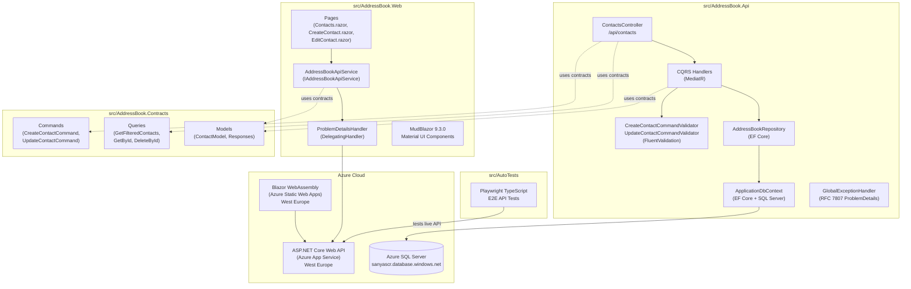
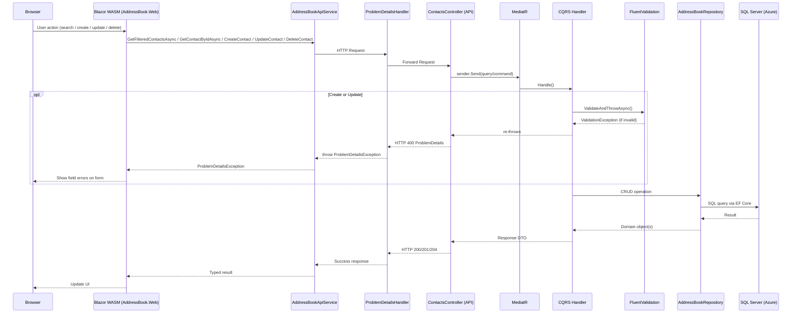
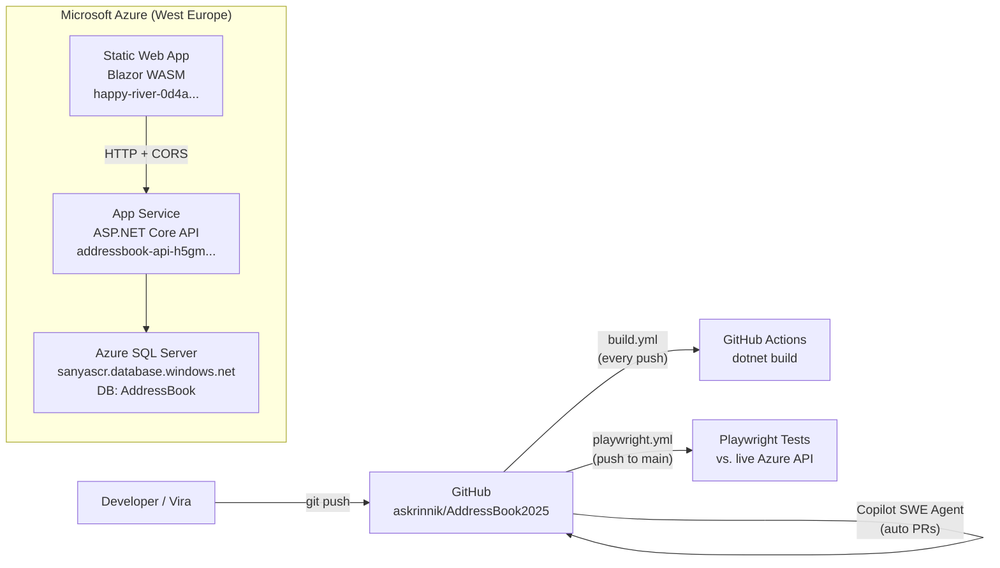

# Research Report: `askrinnik/AddressBook2025`

> **Repo:** [askrinnik/AddressBook2025](https://github.com/askrinnik/AddressBook2025)  
> **Head commit:** `b2aa3f742b5f21ede8ab8dc3a0b8993ad55f8c73`  
> **Report date:** 2026-05-05  
> **Last updated:** 2026-05-05 — added `PUT /api/contacts/{id}` Update Contact endpoint; added Edit Contact UI (`/edit-contact/{id}` page, Edit button on contacts list)

---

## Executive Summary

`AddressBook2025` is a full-stack, cloud-hosted pet/learning project that implements a contact management (address book) application. It is written in **C# / .NET 10**, with a **Blazor WebAssembly** frontend (MudBlazor UI), an **ASP.NET Core Web API** backend following a clean CQRS + MediatR architecture, a shared contracts library, and a **Playwright/TypeScript** end-to-end test suite. The application is deployed on **Microsoft Azure** (App Service for the API, Azure Static Web Apps for the Blazor UI, Azure SQL for data). Development is collaborative between two contributors (Alexander Skrinnik and Vira Skrynnik), with extensive use of **GitHub Copilot coding agent** for automated PR creation and feature implementation. The project has been consistently maintained with 36 tracked issues, 14 pull requests, and active CI/CD via GitHub Actions.

---

## Key Repositories Summary

| Repository | Language | Purpose |
|---|---|---|
| [askrinnik/AddressBook2025](https://github.com/askrinnik/AddressBook2025) | C# / TypeScript | Full-stack contacts app: API + Blazor UI + E2E tests |

---

## Architecture Overview



---

## Project Structure

```
askrinnik/AddressBook2025/
├── .github/
│   ├── copilot-instructions.md      # "Source code supports non-English comments"
│   ├── ISSUE_TEMPLATE/
│   └── workflows/
│       ├── build.yml                # CI: dotnet build on every push
│       └── playwright.yml           # E2E tests on push/PR to main
├── docs/
│   ├── 01_Software_project_docs.md  # Russian-language pre-dev checklist
│   ├── 02_BRD.md                    # Business Requirements Document
│   ├── 03_FRS.md                    # Functional Requirements Specification
│   ├── Azure_environment.md         # Deployment guide
│   ├── How_to_run_from_console.md   # Local run instructions
│   └── Test plan.md                 # QA test plan
├── src/
│   ├── AddressBook.sln              # VS 2022 solution file
│   ├── AddressBook.Api/             # ASP.NET Core Web API
│   ├── AddressBook.Contracts/       # Shared MediatR contracts (DTOs)
│   ├── AddressBook.Web/             # Blazor WebAssembly SPA
│   └── AutoTests/                   # Playwright TypeScript E2E tests
└── README.md                        # Minimal: "pet project for address book development"
```

---

## Component Deep-Dives

### 1. `AddressBook.Contracts` — Shared Contracts Library

The contracts project is a thin shared library referenced by both the API and the Web frontend. It defines all MediatR request/response types and shared DTOs.

**Directory:**[^1]

| File | Type | Description |
|---|---|---|
| `CreateContactCommand.cs` | `class` | Mutable command with `FirstName`, `LastName`, `DateOnly? Birthday` |
| `UpdateContactCommand.cs` | `class` | Mutable command with `Id`, `FirstName`, `LastName`, `DateOnly? Birthday` — for PUT endpoint |
| `DeleteContactByIdQuery.cs` | `record` | `DeleteContactByIdQuery(int Id)` |
| `GetContactByIdQuery.cs` | `record` | `GetContactByIdQuery(int Id)` |
| `GetFilteredContactsQuery.cs` | `record` | `GetFilteredContactsQuery(string? SearchText)` |
| `Models/ContactModel.cs` | `record` | `ContactModel(int Id, string FirstName, string LastName, DateOnly? Birthday)` |
| `Models/CreateContactCommandResponse.cs` | `record` | `CreateContactCommandResponse(int Id)` |
| `Models/DeleteContactByIdResponse.cs` | `record` | `DeleteContactByIdResponse(bool Success)` |
| `Models/GetFilteredContactsResponse.cs` | `record` | `GetFilteredContactsResponse(int TotalRows, IReadOnlyCollection<ContactModel> Rows)` |
| `Models/UpdateContactCommandResponse.cs` | `record` | `UpdateContactCommandResponse(bool Found)` — signals 404 if contact not found |

**Complete Contract Definitions:**[^2]

```csharp
// CreateContactCommand.cs — mutable class (unlike other records)
public class CreateContactCommand : IRequest<CreateContactCommandResponse>
{
    public string FirstName { get; set; } = string.Empty;
    public string LastName  { get; set; } = string.Empty;
    public DateOnly? Birthday { get; set; }
}

// ContactModel.cs — shared read DTO
public record ContactModel(int Id, string FirstName, string LastName, DateOnly? Birthday);

// GetFilteredContactsResponse.cs — supports pagination UI
public record GetFilteredContactsResponse(int TotalRows, IReadOnlyCollection<ContactModel> Rows);
```

---

### 2. `AddressBook.Api` — ASP.NET Core Web API

#### 2a. Domain Model

The domain uses **strongly-typed value-object IDs** (`sealed record` wrappers over `int`) to prevent primitive obsession.[^3]

```csharp
// Contact.cs — aggregate root
public sealed class Contact : Entity<ContactId>
{
    public OwnerId OwnerId { get; set; } = OwnerId.Default(); // hardcoded to 1 (single-tenant)
    public string FirstName { get; set; } = string.Empty;
    public string LastName  { get; set; } = string.Empty;
    public DateOnly? Birthday { get; set; }
    public List<Phone> Phones { get; set; } = [];
}

// ContactId.cs — strongly-typed ID
public sealed record ContactId(int Value) { public static ContactId New() => new(0); }

// OwnerId.cs — placeholder for future multi-tenancy
public sealed record OwnerId(int Value) { public static OwnerId Default() => new(1); }
```

The domain also includes `Phone` and `PhoneOperator` entities (per the FRS), though Phone management is not yet surfaced in the API.[^4]

#### 2b. Repository Interfaces (Port Abstraction)

Five generic interfaces in `src/AddressBook.Api/Interfaces/` define the data access ports:[^5]

```csharp
public interface ICreate<T>                              { Task<T>    CreateAsync(T item); }
public interface IDelete<in T>                           { Task<int>  DeleteAsync(T key); }  // returns row count
public interface IExist<in T>                            { Task<bool> ExistAsync(T key); }
public interface IRetrieve<in TKey, TOut>                { Task<TOut?> TryRetrieveAsync(TKey key); }
public interface IRetrieveMany<in TKey, TOut>            { Task<IReadOnlyCollection<TOut>> RetrieveManyAsync(TKey key); }
public interface IUpdate<in TKey, in T>                  { Task<bool> UpdateAsync(TKey key, T item); }  // returns true if found
```

#### 2c. Controller

`ContactsController` is a thin pass-through to MediatR:[^6]

```csharp
[ApiController]
[Route("api/[controller]")]
public class ContactsController(ISender sender) : ControllerBase
{
    [HttpGet]    // GET /api/contacts?search=...
    public async Task<GetFilteredContactsResponse> Get([FromQuery] string? search, CancellationToken token)
        => await sender.Send(new GetFilteredContactsQuery(search), token);

    [HttpGet("{id:int}")]  // GET /api/contacts/{id}
    public async Task<ActionResult<ContactModel>> GetById([FromRoute] int id, CancellationToken token)
    {
        var contactModel = await sender.Send(new GetContactByIdQuery(id), token);
        return contactModel == null ? NotFound() : Ok(contactModel);
    }

    [HttpPost]   // POST /api/contacts → 201 Created + Location header
    public async Task<ActionResult> CreateContact([FromBody] CreateContactCommand request, CancellationToken token)
    {
        var response = await sender.Send(request, token);
        return CreatedAtAction(nameof(GetById), new { id = response.Id }, null);
    }

    [HttpDelete("{id:int}")]  // DELETE /api/contacts/{id} → 204 / 404
    public async Task<ActionResult> DeleteContact([FromRoute] int id, CancellationToken token)
    {
        var response = await sender.Send(new DeleteContactByIdQuery(id), token);
        return !response.Success ? NotFound() : NoContent();
    }

    [HttpPut("{id:int}")]  // PUT /api/contacts/{id} → 204 / 404 / 400
    public async Task<ActionResult> UpdateContact([FromRoute] int id, [FromBody] UpdateContactCommand request, CancellationToken token)
    {
        request.Id = id;
        var response = await sender.Send(request, token);
        return response.Found ? NoContent() : NotFound();
    }
}
```

**API Endpoint Summary:**

| Method | Route | Success | Error |
|---|---|---|---|
| GET | `/api/contacts?search=text` | 200 `GetFilteredContactsResponse` | — |
| GET | `/api/contacts/{id}` | 200 `ContactModel` | 404 |
| POST | `/api/contacts` | 201 + `Location` header | 400 (validation) |
| PUT | `/api/contacts/{id}` | 204 No Content | 404, 400 (validation) |
| DELETE | `/api/contacts/{id}` | 204 No Content | 404 |

#### 2d. CQRS Application Handlers

Each handler follows primary constructor injection (C# 12):[^7]

```csharp
// CreateContactCommandHandler — validates, trims, persists
internal class CreateContactCommandHandler(ICreate<Contact> create, IValidator<CreateContactCommand> validator)
    : IRequestHandler<CreateContactCommand, CreateContactCommandResponse>
{
    public async Task<CreateContactCommandResponse> Handle(CreateContactCommand request, CancellationToken ct)
    {
        await validator.ValidateAndThrowAsync(request, ct);
        var contact = new Contact {
            FirstName = request.FirstName.Trim(),
            LastName  = request.LastName.Trim(),
            Birthday  = request.Birthday,
            OwnerId   = OwnerId.Default()
        };
        var created = await create.CreateAsync(contact);
        return new(created.Id.Value);
    }
}

// UpdateContactCommandHandler — validates, trims, updates via ExecuteUpdateAsync
internal class UpdateContactCommandHandler(IUpdate<ContactId, Contact> update, IValidator<UpdateContactCommand> validator)
    : IRequestHandler<UpdateContactCommand, UpdateContactCommandResponse>
{
    public async Task<UpdateContactCommandResponse> Handle(UpdateContactCommand request, CancellationToken ct)
    {
        await validator.ValidateAndThrowAsync(request, ct);
        var contact = new Contact {
            FirstName = request.FirstName.Trim(),
            LastName  = request.LastName.Trim(),
            Birthday  = request.Birthday
        };
        var found = await update.UpdateAsync(new ContactId(request.Id), contact);
        return new(found);
    }
}
```

#### 2e. Validation

`CreateContactCommandValidator` and `UpdateContactCommandValidator` (FluentValidation) enforce identical field rules:[^8]

```csharp
RuleFor(x => x.FirstName).NotEmpty().MaximumLength(30);
RuleFor(x => x.LastName).NotEmpty().MaximumLength(30);
RuleFor(x => x.Birthday)
    .LessThanOrEqualTo(DateOnly.FromDateTime(DateTime.Today))
    .When(x => x.Birthday.HasValue)
    .WithMessage("Birthday cannot be in the future");
```

#### 2f. Data Access (EF Core)

`AddressBookRepository` implements all 5 repository interfaces and uses **EF Core 10 with SQL Server**.[^9] A custom `Unwrap()` extension trick (mapped as a transparent SQL function) allows LINQ to translate strongly-typed ID comparisons to SQL:

```csharp
// Search by first or last name
public async Task<IReadOnlyCollection<Contact>> RetrieveManyAsync(GetFilteredContactsQuery key)
{
    IQueryable<Contact> query = dbContext.Contacts;
    if (!string.IsNullOrWhiteSpace(key.SearchText))
        query = query.Where(c => c.FirstName.Contains(key.SearchText) || c.LastName.Contains(key.SearchText));
    return await query.AsNoTracking().ToArrayAsync();
}

// Eager-load phones on GET by ID
public async Task<Contact?> TryRetrieveAsync(ContactId key) =>
    await dbContext.Contacts.Include(c => c.Phones).AsNoTracking()
        .FirstOrDefaultAsync(c => c.Id.Unwrap() == key.Value);

// Bulk update via ExecuteUpdateAsync (no change-tracking overhead)
public async Task<bool> UpdateAsync(ContactId key, Contact item)
{
    var rows = await dbContext.Contacts
        .Where(c => c.Id.Unwrap() == key.Value)
        .ExecuteUpdateAsync(s => s
            .SetProperty(c => c.FirstName, item.FirstName)
            .SetProperty(c => c.LastName, item.LastName)
            .SetProperty(c => c.Birthday, item.Birthday));
    return rows > 0;
}
```

**Seed data** ships with the migrations: 3 Ukrainian/Estonian phone operators, 2 demo contacts (John Doe, Jane Smith) with phones.[^10]

**DI registration** (Interface Segregation): `AddressBookRepository` is registered 6 times, once per interface:[^11]
```csharp
builder.Services.AddScoped<IRetrieveMany<GetFilteredContactsQuery, Contact>, AddressBookRepository>();
builder.Services.AddScoped<IRetrieve<ContactId, Contact>,                    AddressBookRepository>();
builder.Services.AddScoped<ICreate<Contact>,                                 AddressBookRepository>();
builder.Services.AddScoped<IDelete<ContactId>,                               AddressBookRepository>();
builder.Services.AddScoped<IUpdate<ContactId, Contact>,                      AddressBookRepository>();
builder.Services.AddScoped<IExist<ContactId>,                                AddressBookRepository>();
```

#### 2g. Global Exception Handler (RFC 7807)

`GlobalExceptionHandler` maps exceptions to structured `ProblemDetails` responses:[^12]

- **`FluentValidation.ValidationException`** → HTTP 400 with `errors` dictionary grouping messages by property name
- **Any other exception** → HTTP 500 with exception type as title; stack trace included in Development environment

```csharp
private static void SetValidationErrors(ProblemDetails pd, ValidationException ex)
{
    pd.Title  = "Validation Error";
    pd.Status = StatusCodes.Status400BadRequest;
    pd.Detail = "One or more validation errors occurred";
    pd.Extensions["errors"] = ex.Errors
        .GroupBy(e => e.PropertyName)
        .ToDictionary(g => g.Key, g => g.Select(x => x.ErrorMessage).ToArray());
}
```

> **⚠️ Open Issue #50:** The `UseExceptionHandler` middleware is placed *after* `MapControllers()` in the pipeline, meaning exceptions thrown inside controllers bypass the handler. Draft PR #51 (Copilot-authored) moves `UseExceptionHandler` before the controller mapping to fix this.[^13]

#### 2h. Startup / Configuration

The API supports **environment-specific database credentials** — the base connection string uses Windows Auth (`Trusted_Connection=true`) for local dev, but overrides are read at startup from `Database:Server`, `Database:User`, `Database:Password` configuration keys (injected via `--Database:Password=<PWD>` CLI arg in production).[^14]

CORS is fully open (`AllowAnyOrigin / Method / Header`) with all response headers exposed — designed for the Blazor WASM client.[^15]

OpenAPI is served via **Swashbuckle** (`/swagger`) and **Scalar** (`/scalar`).[^15]

---

### 3. `AddressBook.Web` — Blazor WebAssembly Frontend

#### 3a. Setup & DI

```csharp
// Program.cs — Web frontend entry point
builder.Services.AddTransient<ProblemDetailsHandler>();
builder.Services.AddScoped<IAddressBookApiService, AddressBookApiService>();

builder.Services.AddHttpClient<IAddressBookApiService, AddressBookApiService>(
        client => client.BaseAddress = new(builder.Configuration["API_Prefix"] ?? "http://localhost:5000/api/"))
    .AddHttpMessageHandler<ProblemDetailsHandler>();

builder.Services.AddMudServices();
```

The API base URL is configurable via `API_Prefix` in `appsettings.json` (defaults to `http://localhost:5000/api/`).[^16]

#### 3b. API Service

`AddressBookApiService` wraps all HTTP calls and implements `IAddressBookApiService`:[^17]

```csharp
// IAddressBookApiService — service contract
Task<GetFilteredContactsResponse?> GetFilteredContactsAsync(string searchTerm, CancellationToken ct);
Task DeleteContact(int id);
Task<int> CreateContact(CreateContactModel model);
Task<ContactModel?> GetContactByIdAsync(int id, CancellationToken ct);   // GET contacts/{id}, 404 → null
Task UpdateContact(int id, CreateContactModel model, CancellationToken ct); // PUT contacts/{id}
```

```csharp
public async Task<GetFilteredContactsResponse?> GetFilteredContactsAsync(string searchTerm, CancellationToken ct)
{
    var requestUri = "contacts";
    if (!string.IsNullOrWhiteSpace(searchTerm))
        requestUri += $"?search={searchTerm}";
    return await httpClient.GetFromJsonAsync<GetFilteredContactsResponse>(requestUri, ct);
}

public async Task<int> CreateContact(CreateContactModel model)
{
    var command = new CreateContactCommand { FirstName = model.FirstName, LastName = model.LastName,
        Birthday = model.Birthday.HasValue ? DateOnly.FromDateTime(model.Birthday.Value) : null };
    var response = await httpClient.PostAsJsonAsync("contacts", command);
    if (response.IsSuccessStatusCode)
    {
        var idString = response.Headers.Location?.Segments.LastOrDefault();
        return int.TryParse(idString, out var id) ? id : 0;
    }
    return 0;
}

public async Task<ContactModel?> GetContactByIdAsync(int id, CancellationToken ct)
{
    var response = await httpClient.GetAsync($"contacts/{id}", ct);
    if (response.StatusCode == HttpStatusCode.NotFound) return null;
    response.EnsureSuccessStatusCode();
    return await response.Content.ReadFromJsonAsync<ContactModel>(ct);
}

public async Task UpdateContact(int id, CreateContactModel model, CancellationToken ct)
{
    var command = new UpdateContactCommand { FirstName = model.FirstName, LastName = model.LastName,
        Birthday = model.Birthday.HasValue ? DateOnly.FromDateTime(model.Birthday.Value) : null };
    var response = await httpClient.PutAsJsonAsync($"contacts/{id}", command, ct);
    response.EnsureSuccessStatusCode();
}
```

#### 3c. Error Handling Pipeline

HTTP errors flow through `ProblemDetailsHandler` (a `DelegatingHandler`), which intercepts all non-2xx responses and deserializes the RFC 7807 body into a `ProblemDetailsException`:[^18]

```csharp
public class ProblemDetailsHandler : DelegatingHandler
{
    protected override async Task<HttpResponseMessage> SendAsync(HttpRequestMessage request, CancellationToken ct)
    {
        var response = await base.SendAsync(request, ct);
        if (response.IsSuccessStatusCode) return response;
        var body = await response.Content.ReadAsStringAsync(ct);
        throw new ProblemDetailsException(body.ToProblemDetails());
    }
}
```

The `CreateContact` and `EditContact` pages catch `ProblemDetailsException` and map server-side field errors back to individual form fields via `ValidationMessageStore`.[^19]

#### 3d. Pages

**`/contacts` (`Contacts.razor`)** — MudBlazor server-reloading table with search, sort, edit, delete:[^20]
- Search box triggers `_contactTable.ReloadServerData()` on change
- Sort is performed client-side on the page's data (not server-side pagination)
- **Edit** button (blue, pencil icon) per row → navigates to `/edit-contact/{id}`
- Delete shows a `MudMessageBox` confirmation dialog before calling the API
- Error state shown via cascading `Error` component

**`/create-contact` (`CreateContact.razor`)** — MudBlazor form with EditContext validation:[^21]
- `MudDatePicker` for optional birthday
- Submits via `HandleCreateContact()` → navigates to `/contacts` on success
- Maps `ProblemDetailsException` field errors to form validation state

**`/edit-contact/{Id:int}` (`EditContact.razor`)** — Edit form for an existing contact:
- Loads existing contact via `GetContactByIdAsync(Id)` on `OnInitializedAsync`; shows "Contact not found" alert on 404
- Pre-fills the same MudCard form (MudTextField×2 + MudDatePicker)
- Submits via `HandleUpdateContact()` → calls `PUT /api/contacts/{id}` → navigates to `/contacts` on success
- Maps `ProblemDetailsException` field errors to form validation state (same as Create)
- **Save** / **Cancel** (→ `/contacts`) buttons

**`/` (`Home.razor`)** — Static welcome page[^22]

#### 3e. Layout

`MainLayout.razor` provides a MudBlazor Material Design shell with:[^23]
- App bar with app name ("Contact Book"), dark/light mode toggle
- Collapsible side drawer with `NavMenu.razor` (`Home`, `Contacts` nav links)
- `Error.razor` cascading value wraps the entire app for global error banner display

#### 3f. Azure Static Web Apps Routing

A `staticwebapp.config.json` in `wwwroot` configures Azure Static Web Apps to return `index.html` for all non-asset routes, enabling client-side Blazor routing on page refresh (fixes issue #35).[^24]

---

### 4. `AutoTests` — Playwright/TypeScript E2E Tests

Tests run against the **live Azure API** at `https://addressbook-api-h5gmdghdcyfaf6gu.westeurope-01.azurewebsites.net/api/`.[^25]

**Test coverage in `api-testing.spec.ts`:**[^26]

| Test Group | Scenarios |
|---|---|
| GET /api/Contacts | Get all; search by term (`skr`); verify expected contact names |
| GET /api/Contacts/{id} | Valid ID (1 → John Doe) → 200; Non-existent ID → 404 |
| POST /api/Contacts | Create with birthday + verify + delete; create without birthday; create with 31-char names → 400; create with future date → 400 + `Birthday` field error |
| DELETE /api/Contacts/{id} | Non-existent ID → 404 |

The `ApiClient` class (`api-client.ts`) is a singleton wrapping `APIRequestContext`, with helpers for both "happy path" typed responses and raw `APIResponse` for error scenarios.[^27]

**DTO classes:**[^28]
```typescript
export class Contact {
    static createCorrectContactWithBirthday()    // → Petr Petrov, 2011-11-11
    static createCorrectContactWithoutBirthday() // → Petr Petrov, no birthday
    static createIncorrectContact()              // → 31-char first/last (over limit)
    static createContactWithFutureDate()         // → Petr Petrov, 2100-11-11
}
```

---

### 5. CI/CD

**`build.yml`** — Triggers on every push; runs `dotnet restore` + `dotnet build --configuration Release` on `ubuntu-latest` with .NET 10.0.x.[^29]

**`playwright.yml`** — Triggers on push/PR to `main`; runs `npm ci` + `npx playwright install --with-deps` + `npx playwright test` in `src/AutoTests`; uploads HTML report as artifact for 30 days.[^30]

---

### 6. GitHub Copilot Integration

The project demonstrates heavy Copilot coding agent use:[^31]

| PR | Author | Task |
|---|---|---|
| #51 (open draft) | `copilot-swe-agent[bot]` | Fix exception handler middleware order |
| #48 | `copilot-swe-agent[bot]` | Upgrade solution from .NET 9 → .NET 10 |
| #42 | `copilot-swe-agent[bot]` | Fix Azure SWA 404 on page refresh (`staticwebapp.config.json`) |
| #41 | `copilot-swe-agent[bot]` | Add future-birthday validation to `CreateContactCommandValidator` |

`.github/copilot-instructions.md` contains a single instruction: *"Source code supports non-English comments"* — allowing Russian-language comments in code.[^32]

---

### 7. Documentation (`docs/`)

| Document | Language | Content |
|---|---|---|
| `01_Software_project_docs.md` | Russian | ChatGPT-generated pre-dev checklist (BRD, FRS, NFR, SAD, SRS, Test Plan) |
| `02_BRD.md` | English | Business Requirements — CRUD contacts, search/filter, web-based, no mobile/CRM integrations |
| `03_FRS.md` | English | Functional Spec — 3 entities (Contact, Phone, PhoneOperator), CRUD, field constraints (max 30 chars), future: emails/categories |
| `Azure_environment.md` | English | Azure deployment URLs, SQL server name, how to warm up the service |
| `How_to_run_from_console.md` | English | BAT script: `git pull` → `dotnet build` → `dotnet run --Database:Password=<PASSWORD>` |
| `Test plan.md` | Mixed | QA test plan document |

---

### 8. Database Schema

Derived from EF Core entity configurations and seed data:[^10]

```
Contacts
  Id          INT  IDENTITY PK
  OwnerId     INT  NOT NULL          (always 1 in current impl)
  FirstName   NVARCHAR(30) NOT NULL
  LastName    NVARCHAR(30) NOT NULL
  Birthday    DATE  NULL

Phones
  Id                INT  IDENTITY PK
  ContactId         INT  FK → Contacts.Id
  PhoneOperatorId   INT  FK → PhoneOperators.Id
  PhoneNumber       NVARCHAR(15) NOT NULL
  Comment           NVARCHAR(100) NULL

PhoneOperators
  Id           INT  IDENTITY PK
  Name         NVARCHAR(30) NOT NULL
  Description  NVARCHAR(100) NOT NULL

Seed: Vodafone UA, Kyivstar UA, Super EE (Estonia)
Seed: John Doe (1990-01-01), Jane Smith (1992-02-02) with 2 phones each
```

> **Note:** `PhoneNumber` max length is 15 in EF config vs. 20 in the FRS — a minor discrepancy.[^33]

---

## Request Flow Diagram



---

## Deployment Architecture



---

## Notable Design Decisions

| Decision | Detail |
|---|---|
| **Strongly-typed IDs** | All PKs are `sealed record` wrappers (`ContactId(int Value)`). EF Core uses `HasConversion` + `Unwrap()` SQL function trick to translate LINQ comparisons server-side.[^34] |
| **Interface Segregation for repo** | `AddressBookRepository` implements 5 interfaces, each registered separately as `AddScoped<IXxx>`. Handlers depend only on the interface they need.[^11] |
| **No authentication** | `UseAuthorization()` and `UseHttpsRedirection()` are commented out. `OwnerId.Default()` always returns `new(1)` — explicit single-tenant placeholder for future work.[^15] |
| **Swagger generation detection** | `Program.cs` detects `dotnet swagger tofile` to skip DB migration during OpenAPI spec generation.[^35] |
| **`DeleteContactByIdQuery` naming** | Named a "Query" but performs a delete mutation — acknowledged naming inconsistency in the codebase.[^36] |
| **`CreateContactCommand` / `UpdateContactCommand` are classes** | Unlike all other contracts which are `record` types, these two mutable commands are `class` — unusual for commands but consistent with each other.[^2] |
| **Client-side pagination** | `GetFilteredContactsResponse` includes `TotalRows`, but sorting/paging is done client-side in `Contacts.razor` (not server-side). `TotalRows` is wired to MudTable's `TotalItems`.[^20] |

---

## Issues & Development History

### Open Issue

| # | Title | Description |
|---|---|---|
| **#50** | Handle exceptions in API | Wrong DB name → GET contact → 500 with no details instead of `ProblemDetails`; being fixed by Draft PR #51[^13] |

### Completed Feature Milestones (closed issues)

| Phase | Issues |
|---|---|
| Onboarding & Setup | #1–#9: GH account setup, software install, Git config for Vira |
| Documentation | #3, #10: BRD/FRS docs, test documentation |
| API Development | #11, #14, #21, #29: GET list, POST create, GET by ID, DELETE by ID |
| UI Development | #15, #30, #32, #38: Contacts page, Delete button, Create page, MudBlazor migration |
| Bug Fixes (API) | #16, #18, #23–#25, #27–#28: Search bugs, HTML body instead of JSON, 500→400 for long names |
| Bug Fixes (UI) | #26, #31, #33–#35, #37: Column title typo, delete dialog text, birthday display, 404 on refresh, autofill overlap |
| Enhancements | #36: Future birthday validation |
| Upgrades | #47: .NET 9 → .NET 10 |

---

## Confidence Assessment

| Claim | Confidence | Source |
|---|---|---|
| Tech stack (.NET 10, Blazor WASM, MudBlazor, EF Core, SQL Server) | **High** | `*.csproj` files, commit messages |
| Architecture (CQRS + MediatR, clean layering) | **High** | Complete source code fetched |
| Azure deployment URLs | **High** | `docs/Azure_environment.md`, `api-client.ts` |
| No authentication (single-tenant) | **High** | `StartupExtensions.cs` commented-out auth, `OwnerId.Default()` |
| Phone management not yet in API | **High** | No Phone endpoints in `ContactsController`; entities exist in domain |
| Future plans (email, categories, multi-tenancy) | **Medium** | Inferred from FRS "Future Enhancements" + `OwnerId` design |
| Test plan content | **Low** | `docs/Test plan.md` found but not fetched in full |

---

## Footnotes

[^1]: [src/AddressBook.Contracts/ (directory)](https://github.com/askrinnik/AddressBook2025/tree/b2aa3f742b5f21ede8ab8dc3a0b8993ad55f8c73/src/AddressBook.Contracts)
[^2]: [src/AddressBook.Contracts/CreateContactCommand.cs](https://github.com/askrinnik/AddressBook2025/blob/b2aa3f742b5f21ede8ab8dc3a0b8993ad55f8c73/src/AddressBook.Contracts/CreateContactCommand.cs) SHA: `3dcc5faf` | [Models/ContactModel.cs](https://github.com/askrinnik/AddressBook2025/blob/b2aa3f742b5f21ede8ab8dc3a0b8993ad55f8c73/src/AddressBook.Contracts/Models/ContactModel.cs) SHA: `bc2bd3a3` | [Models/GetFilteredContactsResponse.cs](https://github.com/askrinnik/AddressBook2025/blob/b2aa3f742b5f21ede8ab8dc3a0b8993ad55f8c73/src/AddressBook.Contracts/Models/GetFilteredContactsResponse.cs) SHA: `14539636`
[^3]: [src/AddressBook.Api/Domain/Contact.cs](https://github.com/askrinnik/AddressBook2025/blob/b2aa3f742b5f21ede8ab8dc3a0b8993ad55f8c73/src/AddressBook.Api/Domain/Contact.cs) SHA: `32846cd5` | [Domain/ContactId.cs](https://github.com/askrinnik/AddressBook2025/blob/b2aa3f742b5f21ede8ab8dc3a0b8993ad55f8c73/src/AddressBook.Api/Domain/ContactId.cs) SHA: `d4da3cb4` | [Domain/OwnerId.cs](https://github.com/askrinnik/AddressBook2025/blob/b2aa3f742b5f21ede8ab8dc3a0b8993ad55f8c73/src/AddressBook.Api/Domain/OwnerId.cs) SHA: `7c15bf4e`
[^4]: [src/AddressBook.Api/Domain/Phone.cs](https://github.com/askrinnik/AddressBook2025/blob/b2aa3f742b5f21ede8ab8dc3a0b8993ad55f8c73/src/AddressBook.Api/Domain/Phone.cs) SHA: `42d17891` | [Domain/PhoneOperator.cs](https://github.com/askrinnik/AddressBook2025/blob/b2aa3f742b5f21ede8ab8dc3a0b8993ad55f8c73/src/AddressBook.Api/Domain/PhoneOperator.cs) SHA: `5cdc6ca9`
[^5]: [src/AddressBook.Api/Interfaces/ICreate.cs](https://github.com/askrinnik/AddressBook2025/blob/b2aa3f742b5f21ede8ab8dc3a0b8993ad55f8c73/src/AddressBook.Api/Interfaces/ICreate.cs) SHA: `983e1557` | [IDelete.cs](https://github.com/askrinnik/AddressBook2025/blob/b2aa3f742b5f21ede8ab8dc3a0b8993ad55f8c73/src/AddressBook.Api/Interfaces/IDelete.cs) SHA: `7400eea6` | [IRetrieve.cs](https://github.com/askrinnik/AddressBook2025/blob/b2aa3f742b5f21ede8ab8dc3a0b8993ad55f8c73/src/AddressBook.Api/Interfaces/IRetrieve.cs) SHA: `dea938e5` | [IRetrieveMany.cs](https://github.com/askrinnik/AddressBook2025/blob/b2aa3f742b5f21ede8ab8dc3a0b8993ad55f8c73/src/AddressBook.Api/Interfaces/IRetrieveMany.cs) SHA: `9bbc330e`
[^6]: [src/AddressBook.Api/Controllers/ContactsController.cs](https://github.com/askrinnik/AddressBook2025/blob/b2aa3f742b5f21ede8ab8dc3a0b8993ad55f8c73/src/AddressBook.Api/Controllers/ContactsController.cs) SHA: `d64c8556`
[^7]: [src/AddressBook.Api/Application/CreateContactCommandHandler.cs](https://github.com/askrinnik/AddressBook2025/blob/b2aa3f742b5f21ede8ab8dc3a0b8993ad55f8c73/src/AddressBook.Api/Application/CreateContactCommandHandler.cs) SHA: `36498cd5` | [GetContactByIdQueryHandler.cs](https://github.com/askrinnik/AddressBook2025/blob/b2aa3f742b5f21ede8ab8dc3a0b8993ad55f8c73/src/AddressBook.Api/Application/GetContactByIdQueryHandler.cs) SHA: `7ca7ed37` | [GetFilteredContactsQueryHandler.cs](https://github.com/askrinnik/AddressBook2025/blob/b2aa3f742b5f21ede8ab8dc3a0b8993ad55f8c73/src/AddressBook.Api/Application/GetFilteredContactsQueryHandler.cs) SHA: `69fab1f8` | [DeleteContactByIdQueryHandler.cs](https://github.com/askrinnik/AddressBook2025/blob/b2aa3f742b5f21ede8ab8dc3a0b8993ad55f8c73/src/AddressBook.Api/Application/DeleteContactByIdQueryHandler.cs) SHA: `e5f801e7`
[^8]: [src/AddressBook.Api/Application/CreateContactCommandValidator.cs](https://github.com/askrinnik/AddressBook2025/blob/b2aa3f742b5f21ede8ab8dc3a0b8993ad55f8c73/src/AddressBook.Api/Application/CreateContactCommandValidator.cs) SHA: `e4b29e8d`
[^9]: [src/AddressBook.Api/DataAccess/AddressBookRepository.cs](https://github.com/askrinnik/AddressBook2025/blob/b2aa3f742b5f21ede8ab8dc3a0b8993ad55f8c73/src/AddressBook.Api/DataAccess/AddressBookRepository.cs) SHA: `0757cef2`
[^10]: [src/AddressBook.Api/DataAccess/ApplicationDbContext.cs](https://github.com/askrinnik/AddressBook2025/blob/b2aa3f742b5f21ede8ab8dc3a0b8993ad55f8c73/src/AddressBook.Api/DataAccess/ApplicationDbContext.cs) SHA: `35f0c846`
[^11]: [src/AddressBook.Api/DataAccess/StartupExtensions.cs (DataAccess)](https://github.com/askrinnik/AddressBook2025/blob/b2aa3f742b5f21ede8ab8dc3a0b8993ad55f8c73/src/AddressBook.Api/DataAccess/StartupExtensions.cs) SHA: `efcf28b8`
[^12]: [src/AddressBook.Api/GlobalExceptionHandler.cs](https://github.com/askrinnik/AddressBook2025/blob/b2aa3f742b5f21ede8ab8dc3a0b8993ad55f8c73/src/AddressBook.Api/GlobalExceptionHandler.cs) SHA: `efd1be6d`
[^13]: GitHub Issue [#50](https://github.com/askrinnik/AddressBook2025/issues/50) | Draft PR [#51](https://github.com/askrinnik/AddressBook2025/pull/51)
[^14]: [src/AddressBook.Api/appsettings.json](https://github.com/askrinnik/AddressBook2025/blob/b2aa3f742b5f21ede8ab8dc3a0b8993ad55f8c73/src/AddressBook.Api/appsettings.json) SHA: `f6a2ea23` | [docs/How_to_run_from_console.md](https://github.com/askrinnik/AddressBook2025/blob/b2aa3f742b5f21ede8ab8dc3a0b8993ad55f8c73/docs/How_to_run_from_console.md)
[^15]: [src/AddressBook.Api/StartupExtensions.cs](https://github.com/askrinnik/AddressBook2025/blob/b2aa3f742b5f21ede8ab8dc3a0b8993ad55f8c73/src/AddressBook.Api/StartupExtensions.cs) SHA: `d653082b`
[^16]: [src/AddressBook.Web/Program.cs](https://github.com/askrinnik/AddressBook2025/blob/b2aa3f742b5f21ede8ab8dc3a0b8993ad55f8c73/src/AddressBook.Web/Program.cs) SHA: `0ae1eb71`
[^17]: [src/AddressBook.Web/AddressBookApiService.cs](https://github.com/askrinnik/AddressBook2025/blob/b2aa3f742b5f21ede8ab8dc3a0b8993ad55f8c73/src/AddressBook.Web/AddressBookApiService.cs) SHA: `3ba13ab1`
[^18]: [src/AddressBook.Web/ErrorHandling/ProblemDetailsHandler.cs](https://github.com/askrinnik/AddressBook2025/blob/b2aa3f742b5f21ede8ab8dc3a0b8993ad55f8c73/src/AddressBook.Web/ErrorHandling/ProblemDetailsHandler.cs) SHA: `3ea3867b` | [ProblemDetailsException.cs](https://github.com/askrinnik/AddressBook2025/blob/b2aa3f742b5f21ede8ab8dc3a0b8993ad55f8c73/src/AddressBook.Web/ErrorHandling/ProblemDetailsException.cs) SHA: `33139ac0`
[^19]: [src/AddressBook.Web/Pages/CreateContact.razor](https://github.com/askrinnik/AddressBook2025/blob/b2aa3f742b5f21ede8ab8dc3a0b8993ad55f8c73/src/AddressBook.Web/Pages/CreateContact.razor) SHA: `bd03daa3`
[^20]: [src/AddressBook.Web/Pages/Contacts.razor](https://github.com/askrinnik/AddressBook2025/blob/b2aa3f742b5f21ede8ab8dc3a0b8993ad55f8c73/src/AddressBook.Web/Pages/Contacts.razor) SHA: `ee474d20` | [Contacts.razor.cs](https://github.com/askrinnik/AddressBook2025/blob/b2aa3f742b5f21ede8ab8dc3a0b8993ad55f8c73/src/AddressBook.Web/Pages/Contacts.razor.cs) SHA: `3136afd7`
[^21]: src/AddressBook.Web/Pages/CreateContact.razor SHA: `bd03daa3`
[^22]: [src/AddressBook.Web/Pages/Home.razor](https://github.com/askrinnik/AddressBook2025/blob/b2aa3f742b5f21ede8ab8dc3a0b8993ad55f8c73/src/AddressBook.Web/Pages/Home.razor) SHA: `2405e91d`
[^23]: [src/AddressBook.Web/Layout/MainLayout.razor](https://github.com/askrinnik/AddressBook2025/blob/b2aa3f742b5f21ede8ab8dc3a0b8993ad55f8c73/src/AddressBook.Web/Layout/MainLayout.razor) SHA: `ab2b909b` | [NavMenu.razor](https://github.com/askrinnik/AddressBook2025/blob/b2aa3f742b5f21ede8ab8dc3a0b8993ad55f8c73/src/AddressBook.Web/Layout/NavMenu.razor) SHA: `dfa3e681`
[^24]: [docs/Azure_environment.md](https://github.com/askrinnik/AddressBook2025/blob/b2aa3f742b5f21ede8ab8dc3a0b8993ad55f8c73/docs/Azure_environment.md) SHA: `d241ff75` | PR [#42](https://github.com/askrinnik/AddressBook2025/pull/42)
[^25]: [src/AutoTests/tests/api-client.ts](https://github.com/askrinnik/AddressBook2025/blob/b2aa3f742b5f21ede8ab8dc3a0b8993ad55f8c73/src/AutoTests/tests/api-client.ts) SHA: `9a256b97`
[^26]: [src/AutoTests/tests/api-testing.spec.ts](https://github.com/askrinnik/AddressBook2025/blob/b2aa3f742b5f21ede8ab8dc3a0b8993ad55f8c73/src/AutoTests/tests/api-testing.spec.ts) SHA: `377cc97c`
[^27]: src/AutoTests/tests/api-client.ts SHA: `9a256b97`
[^28]: [src/AutoTests/tests/dtos/contact.ts](https://github.com/askrinnik/AddressBook2025/blob/b2aa3f742b5f21ede8ab8dc3a0b8993ad55f8c73/src/AutoTests/tests/dtos/contact.ts) SHA: `74f9555f` | [dtos/ProblemDetails.ts](https://github.com/askrinnik/AddressBook2025/blob/b2aa3f742b5f21ede8ab8dc3a0b8993ad55f8c73/src/AutoTests/tests/dtos/ProblemDetails.ts) SHA: `c8091cc1`
[^29]: [.github/workflows/build.yml](https://github.com/askrinnik/AddressBook2025/blob/b2aa3f742b5f21ede8ab8dc3a0b8993ad55f8c73/.github/workflows/build.yml) SHA: `b66d3ac7`
[^30]: [.github/workflows/playwright.yml](https://github.com/askrinnik/AddressBook2025/blob/b2aa3f742b5f21ede8ab8dc3a0b8993ad55f8c73/.github/workflows/playwright.yml) SHA: `465b75ee`
[^31]: PR [#51](https://github.com/askrinnik/AddressBook2025/pull/51), PR [#48](https://github.com/askrinnik/AddressBook2025/pull/48), PR [#42](https://github.com/askrinnik/AddressBook2025/pull/42), PR [#41](https://github.com/askrinnik/AddressBook2025/pull/41)
[^32]: [.github/copilot-instructions.md](https://github.com/askrinnik/AddressBook2025/blob/b2aa3f742b5f21ede8ab8dc3a0b8993ad55f8c73/.github/copilot-instructions.md) SHA: `04cb6fa8`
[^33]: [src/AddressBook.Api/DataAccess/PhoneConfiguration.cs](https://github.com/askrinnik/AddressBook2025/blob/b2aa3f742b5f21ede8ab8dc3a0b8993ad55f8c73/src/AddressBook.Api/DataAccess/PhoneConfiguration.cs) SHA: `b6386557` vs. [docs/03_FRS.md](https://github.com/askrinnik/AddressBook2025/blob/b2aa3f742b5f21ede8ab8dc3a0b8993ad55f8c73/docs/03_FRS.md)
[^34]: [src/AddressBook.Api/DataAccess/ApplicationDbContext.cs:400-424](https://github.com/askrinnik/AddressBook2025/blob/b2aa3f742b5f21ede8ab8dc3a0b8993ad55f8c73/src/AddressBook.Api/DataAccess/ApplicationDbContext.cs) (ValueObjectExtensions)
[^35]: [src/AddressBook.Api/Program.cs](https://github.com/askrinnik/AddressBook2025/blob/b2aa3f742b5f21ede8ab8dc3a0b8993ad55f8c73/src/AddressBook.Api/Program.cs) SHA: `a08642e1`
[^36]: src/AddressBook.Contracts/DeleteContactByIdQuery.cs SHA: `79789132`
