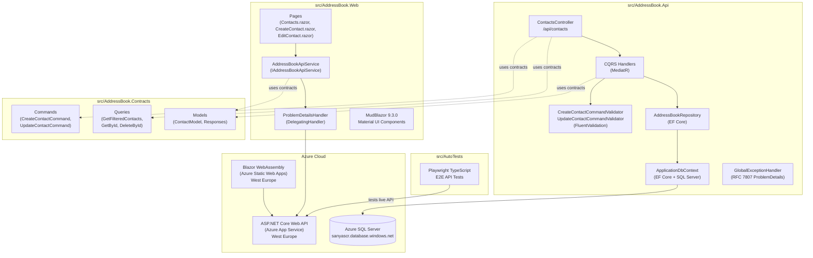
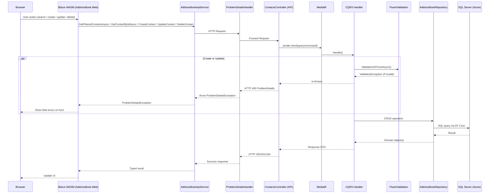
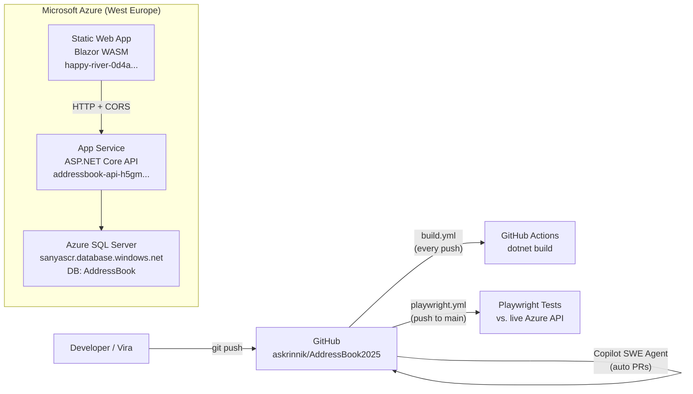

# Research Report: `askrinnik/AddressBook2025`

> **Repo:** [askrinnik/AddressBook2025](https://github.com/askrinnik/AddressBook2025)  
> **Head commit:** `b2aa3f742b5f21ede8ab8dc3a0b8993ad55f8c73`  
> **Report date:** 2026-05-05  
> **Last updated:** 2026-05-26 — corrected CORS, exception handler, and Scalar documentation; added spec document references; marked Issue #50 as resolved

---

## Executive Summary

`AddressBook2025` is a full-stack, cloud-hosted pet/learning project that implements a contact management (address book) application. It is written in **C# / .NET 10**, with a **Blazor WebAssembly** frontend (MudBlazor UI), an **ASP.NET Core Web API** backend following a clean CQRS + MediatR architecture, a shared contracts library, and a **Playwright/TypeScript** end-to-end test suite. The application is deployed on **Microsoft Azure** (App Service for the API, Azure Static Web Apps for the Blazor UI, Azure SQL for data). Development is collaborative between two contributors (Alexander Skrinnik and Vira Skrynnik), with extensive use of **GitHub Copilot coding agent** for automated PR creation and feature implementation. The project has been consistently maintained with 36 tracked issues, 14 pull requests, and active CI/CD via GitHub Actions.

---

## Key Repositories Summary

| Repository | Language | Purpose |
|---|---|---|
| [askrinnik/AddressBook2025](https://github.com/askrinnik/AddressBook2025) | C# / TypeScript | Full-stack contacts app: API + Blazor UI + E2E tests |

---

## Architecture Overview



---

## Project Structure

```
askrinnik/AddressBook2025/
├── .github/
│   ├── copilot-instructions.md      # "Source code supports non-English comments"
│   ├── ISSUE_TEMPLATE/
│   └── workflows/
│       ├── build.yml                # CI: dotnet build on every push
│       └── playwright.yml           # E2E tests on push/PR to main
├── docs/
│   ├── 01_Software_project_docs.md  # Russian-language pre-dev checklist
│   ├── 02_BRD.md                    # Business Requirements Document
│   ├── 03_FRS.md                    # Functional Requirements Specification
│   ├── Azure_environment.md         # Deployment guide
│   ├── How_to_run_from_console.md   # Local run instructions
│   └── Test plan.md                 # QA test plan
├── src/
│   ├── AddressBook.sln              # VS 2022 solution file
│   ├── AddressBook.Api/             # ASP.NET Core Web API
│   ├── AddressBook.Contracts/       # Shared MediatR contracts (DTOs)
│   ├── AddressBook.Web/             # Blazor WebAssembly SPA (code-behind: Contacts.razor.cs)
│   └── AutoTests/                   # Playwright TypeScript E2E tests
└── README.md                        # Minimal: "pet project for address book development"
```

---

## Component Deep-Dives

### 1. `AddressBook.Contracts` — Shared Contracts Library

The contracts project is a thin shared library referenced by both the API and the Web frontend. It defines all MediatR request/response types and shared DTOs.

**Directory:**[^1]

| File | Type | Description |
|---|---|---|
| `CreateContactCommand.cs` | `class` | Mutable command with `FirstName`, `LastName`, `DateOnly? Birthday` |
| `UpdateContactCommand.cs` | `class` | Mutable command with `Id`, `FirstName`, `LastName`, `DateOnly? Birthday` — for PUT endpoint |
| `DeleteContactByIdQuery.cs` | `record` | `DeleteContactByIdQuery(int Id)` |
| `GetContactByIdQuery.cs` | `record` | `GetContactByIdQuery(int Id)` |
| `GetFilteredContactsQuery.cs` | `record` | `GetFilteredContactsQuery(string? SearchText)` |
| `Models/ContactModel.cs` | `record` | `ContactModel(int Id, string FirstName, string LastName, DateOnly? Birthday)` |
| `Models/CreateContactCommandResponse.cs` | `record` | `CreateContactCommandResponse(int Id)` |
| `Models/DeleteContactByIdResponse.cs` | `record` | `DeleteContactByIdResponse(bool Success)` |
| `Models/GetFilteredContactsResponse.cs` | `record` | `GetFilteredContactsResponse(int TotalRows, IReadOnlyCollection<ContactModel> Rows)` |
| `Models/UpdateContactCommandResponse.cs` | `record` | `UpdateContactCommandResponse(bool Found)` — signals 404 if contact not found |

Complete contract definitions (code) → See [`docs/specs/AddressBook.Contracts.md`](../../docs/specs/AddressBook.Contracts.md) for full type signatures and design notes.

→ Full specification: [`docs/specs/AddressBook.Contracts.md`](../../docs/specs/AddressBook.Contracts.md)

---

### 2. `AddressBook.Api` — ASP.NET Core Web API

#### 2a. Domain Model

The domain uses **strongly-typed value-object IDs** (`sealed record` wrappers over `int`) to prevent primitive obsession.[^3]

The domain includes `Contact` (aggregate root with `FirstName`, `LastName`, `Birthday`, `Phones`), `Phone`, and `PhoneOperator` entities. Phone management is not yet surfaced in the API.[^3][^4]

#### 2b. Repository Interfaces (Port Abstraction)

Six generic interfaces in `Interfaces/` define data access ports: `ICreate<T>`, `IDelete<T>`, `IExist<T>`, `IRetrieve<TKey,TOut>`, `IRetrieveMany<TKey,TOut>`, `IUpdate<TKey,T>`.[^5]

#### 2c. Controller

`ContactsController` is a thin pass-through to MediatR, using primary constructor injection of `ISender`.[^6]

**API Endpoint Summary:**

| Method | Route | Success | Error |
|---|---|---|---|
| GET | `/api/contacts?search=text` | 200 `GetFilteredContactsResponse` | — |
| GET | `/api/contacts/{id}` | 200 `ContactModel` | 404 |
| POST | `/api/contacts` | 201 + `Location` header | 400 (validation) |
| PUT | `/api/contacts/{id}` | 204 No Content | 404, 400 (validation) |
| DELETE | `/api/contacts/{id}` | 204 No Content | 404 |

#### 2d. CQRS Application Handlers

Five handlers follow primary constructor injection: `CreateContactCommandHandler` (validate → trim → persist), `UpdateContactCommandHandler` (validate → trim → `ExecuteUpdateAsync`), `GetContactByIdQueryHandler` (returns `ContactModel?`), `GetFilteredContactsQueryHandler` (returns `GetFilteredContactsResponse`), `DeleteContactByIdQueryHandler` (returns success boolean).[^7]

#### 2e. Validation

`CreateContactCommandValidator` and `UpdateContactCommandValidator` (FluentValidation) enforce identical rules: `FirstName`/`LastName` required, max 30 chars; `Birthday` must not be in the future.[^8]

#### 2f. Data Access (EF Core)

`AddressBookRepository` implements all 6 repository interfaces using EF Core 10 with SQL Server.[^9] Key patterns: `Unwrap()` SQL function for strongly-typed ID LINQ queries, `AsNoTracking()` on reads, `ExecuteUpdateAsync` for bulk updates. Seed data includes 3 phone operators and 2 demo contacts.[^10]

**DI registration** (Interface Segregation): `AddressBookRepository` is registered once per interface (6 registrations).[^11]

#### 2g. Global Exception Handler (RFC 7807)

`GlobalExceptionHandler` maps exceptions to structured RFC 7807 `ProblemDetails` responses: `ValidationException` → HTTP 400 with grouped field errors; other exceptions → HTTP 500.[^12]

**Environment-aware error details:** In `Development`, 500 responses include `exception.GetType().Name` as the title, `exception.Message` as detail, the full stack trace, and any `exception.Data` entries. In production, 500s return a generic `"Internal Server Error"` title and `"An unexpected error occurred."` detail — preventing leakage of internal information (DB names, stack traces, etc.).

> **✅ Resolved (Issue #50 / PR #51):** The `UseExceptionHandler` middleware is now placed *first* in the pipeline (before CORS, OpenAPI, and `MapControllers`), ensuring all exceptions are caught by `GlobalExceptionHandler`.[^13]

#### 2h. Startup / Configuration

The API supports **environment-specific database credentials** — the base connection string uses Windows Auth (`Trusted_Connection=true`) for local dev, but overrides are read at startup from `Database:Server`, `Database:User`, `Database:Password` configuration keys (injected via `--Database:Password=<PWD>` CLI arg in production).[^14]

CORS is **production-aware**: when `AllowedOrigins` is configured (e.g., `AllowedOrigins__0=https://your-app.azurestaticapps.net`), only those origins are allowed; when empty/missing, `AllowAnyOrigin()` is used as a dev fallback with a `LogWarning` in non-Development environments. Only the `Location` header is exposed (for `201 Created` responses). Methods and headers remain open (`AllowAnyMethod / AllowAnyHeader`).[^15]

OpenAPI is served via **Swashbuckle** (`/swagger`, `/swagger/ui`) and **Scalar** (`/scalar/v1`). Scalar is configured with `o.OpenApiRoutePattern = "/swagger/{documentName}/swagger.json"` to reuse the Swashbuckle-generated spec.[^15]

→ Full specification: [`docs/specs/AddressBook.Api.md`](../../docs/specs/AddressBook.Api.md)

---

### 3. `AddressBook.Web` — Blazor WebAssembly Frontend

#### 3a. Setup & DI

DI registers `ProblemDetailsHandler` (transient), `AddressBookApiService` (scoped via typed `HttpClient`), and MudBlazor services. The API base URL is configurable via `API_Prefix` in `appsettings.json` (defaults to `http://localhost:5000/api/`).[^16]

#### 3b. API Service

`AddressBookApiService` wraps all HTTP calls (`GetFilteredContactsAsync`, `DeleteContact`, `CreateContact`, `GetContactByIdAsync`, `UpdateContact`) and implements `IAddressBookApiService`. Creates `CreateContactCommand`/`UpdateContactCommand` from UI models, converting `DateTime?` → `DateOnly?`.[^17]

#### 3c. Error Handling Pipeline

HTTP errors flow through `ProblemDetailsHandler` → `ProblemDetailsException`, with supporting types `ClientProblemDetails` and `ProblemDetailsExtensions`. Pages catch `ProblemDetailsException` and map field errors via `ValidationMessageStore`.[^18][^19]

#### 3d. Pages

**`/contacts`** — MudBlazor `MudTable` with search, sort, edit (→ `/edit-contact/{id}`), delete (confirmation dialog). Uses code-behind pattern (`Contacts.razor.cs`).[^20]

**`/create-contact`** — MudBlazor form (`MudTextField`×2 + `MudDatePicker`). Maps `ProblemDetailsException` field errors to form validation.[^21]

**`/edit-contact/{Id:int}`** — Loads contact via `GetContactByIdAsync`; same form as Create; calls `PUT /api/contacts/{id}` on save.

**`/`** — Static welcome page.[^22]

#### 3e. Layout

`MainLayout.razor` provides a MudBlazor shell with app bar (dark/light toggle), collapsible drawer with `NavMenu.razor`, and `Error.razor` cascading error banner.[^23]

#### 3f. Azure Static Web Apps Routing

A `staticwebapp.config.json` in `wwwroot` configures Azure Static Web Apps to return `index.html` for all non-asset routes, enabling client-side Blazor routing on page refresh (fixes issue #35).[^24]

→ Full specification: [`docs/specs/AddressBook.Web.md`](../../docs/specs/AddressBook.Web.md)

---

### 4. `AutoTests` — Playwright/TypeScript E2E Tests

Tests run against the **live Azure API** at `https://addressbook-api-h5gmdghdcyfaf6gu.westeurope-01.azurewebsites.net/api/`.[^25]

**Test coverage in `api-testing.spec.ts`:**[^26]

| Test Group | Scenarios |
|---|---|
| GET /api/Contacts | Get all; search by term (`skr`); verify expected contact names (hardcoded expected: Alex Skr, Vera Skrynnik, Skrynnik Vera) |
| GET /api/Contacts/{id} | Valid ID (1 → John Doe) → 200; Non-existent ID → 404 |
| POST /api/Contacts | Create with birthday + verify + delete; create without birthday; create with 31-char names → 400; create with future date → 400 + `Birthday` field error |
| DELETE /api/Contacts/{id} | Non-existent ID → 404 |

The `ApiClient` class (`api-client.ts`) is a singleton wrapping `APIRequestContext`, with helpers for both "happy path" typed responses and raw `APIResponse` for error scenarios.[^27]

**DTOs:** `Contact` (with factory methods for test data), `GetContactsResponse`, and `ProblemDetails` (RFC 7807 client model).[^28]

→ Full specification: [`docs/specs/AutoTests.md`](../../docs/specs/AutoTests.md)

---

### 5. CI/CD

**`build.yml`** — Triggers on every push; runs `dotnet restore` + `dotnet build --configuration Release` on `ubuntu-latest` with .NET 10.0.x.[^29]

**`playwright.yml`** — Triggers on push/PR to `main`; runs `npm ci` + `npx playwright install --with-deps` + `npx playwright test` in `src/AutoTests`; uploads HTML report as artifact for 30 days.[^30]

---

### 6. GitHub Copilot Integration

The project demonstrates heavy Copilot coding agent use:[^31]

| PR | Author | Task |
|---|---|---|
| #51 (open draft) | `copilot-swe-agent[bot]` | Fix exception handler middleware order |
| #48 | `copilot-swe-agent[bot]` | Upgrade solution from .NET 9 → .NET 10 |
| #42 | `copilot-swe-agent[bot]` | Fix Azure SWA 404 on page refresh (`staticwebapp.config.json`) |
| #41 | `copilot-swe-agent[bot]` | Add future-birthday validation to `CreateContactCommandValidator` |

`.github/copilot-instructions.md` contains a single instruction: *"Source code supports non-English comments"* — allowing Russian-language comments in code.[^32]

---

### 7. Documentation (`docs/`)

| Document | Language | Content |
|---|---|---|
| `01_Software_project_docs.md` | Russian | ChatGPT-generated pre-dev checklist (BRD, FRS, NFR, SAD, SRS, Test Plan) |
| `02_BRD.md` | English | Business Requirements — CRUD contacts, search/filter, web-based, no mobile/CRM integrations |
| `03_FRS.md` | English | Functional Spec — 3 entities (Contact, Phone, PhoneOperator), CRUD, field constraints (max 30 chars), future: emails/categories |
| `Azure_environment.md` | English | Azure deployment URLs, SQL server name, how to warm up the service |
| `How_to_run_from_console.md` | English | BAT script: `git pull` → `dotnet build` → `dotnet run --Database:Password=<PASSWORD>` |
| `Test plan.md` | Mixed | QA test plan document |

---

### 8. Database Schema

Database schema (3 tables: `Contacts`, `Phones`, `PhoneOperators`) with seed data is documented in the Api spec.[^10]

> **Note:** `PhoneNumber` max length is 15 in EF config vs. 20 in the FRS — a minor discrepancy.[^33]

---

## Request Flow Diagram



---

## Deployment Architecture



---

## Notable Design Decisions

| Decision | Detail |
|---|---|
| **Strongly-typed IDs** | All PKs are `sealed record` wrappers (`ContactId(int Value)`). EF Core uses `HasConversion` + `Unwrap()` SQL function trick to translate LINQ comparisons server-side.[^34] |
| **Interface Segregation for repo** | `AddressBookRepository` implements 5 interfaces, each registered separately as `AddScoped<IXxx>`. Handlers depend only on the interface they need.[^11] |
| **No authentication** | `UseAuthorization()` and `UseHttpsRedirection()` are commented out. `OwnerId.Default()` always returns `new(1)` — explicit single-tenant placeholder for future work.[^15] |
| **Swagger generation detection** | `Program.cs` detects `dotnet swagger tofile` to skip DB migration during OpenAPI spec generation.[^35] |
| **`DeleteContactByIdQuery` naming** | Named a "Query" but performs a delete mutation — acknowledged naming inconsistency in the codebase.[^36] |
| **`CreateContactCommand` / `UpdateContactCommand` are classes** | Unlike all other contracts which are `record` types, these two mutable commands are `class` — unusual for commands but consistent with each other.[^2] |
| **Client-side pagination** | `GetFilteredContactsResponse` includes `TotalRows`, but sorting/paging is done client-side in `Contacts.razor` (not server-side). `TotalRows` is wired to MudTable's `TotalItems`.[^20] |

---

## Issues & Development History

### Resolved Issues (previously open)

| # | Title | Resolution |
|---|---|---|
| **#50** | Handle exceptions in API | Fixed — `UseExceptionHandler` moved to first position in pipeline; PR #51 merged[^13] |

### Completed Feature Milestones (closed issues)

| Phase | Issues |
|---|---|
| Onboarding & Setup | #1–#9: GH account setup, software install, Git config for Vira |
| Documentation | #3, #10: BRD/FRS docs, test documentation |
| API Development | #11, #14, #21, #29: GET list, POST create, GET by ID, DELETE by ID |
| UI Development | #15, #30, #32, #38: Contacts page, Delete button, Create page, MudBlazor migration |
| Bug Fixes (API) | #16, #18, #23–#25, #27–#28: Search bugs, HTML body instead of JSON, 500→400 for long names |
| Bug Fixes (UI) | #26, #31, #33–#35, #37: Column title typo, delete dialog text, birthday display, 404 on refresh, autofill overlap |
| Enhancements | #36: Future birthday validation |
| Upgrades | #47: .NET 9 → .NET 10 |

---

## Confidence Assessment

| Claim | Confidence | Source |
|---|---|---|
| Tech stack (.NET 10, Blazor WASM, MudBlazor, EF Core, SQL Server) | **High** | `*.csproj` files, commit messages |
| Architecture (CQRS + MediatR, clean layering) | **High** | Complete source code fetched |
| Azure deployment URLs | **High** | `docs/Azure_environment.md`, `api-client.ts` |
| No authentication (single-tenant) | **High** | `StartupExtensions.cs` commented-out auth, `OwnerId.Default()` |
| Phone management not yet in API | **High** | No Phone endpoints in `ContactsController`; entities exist in domain |
| Future plans (email, categories, multi-tenancy) | **Medium** | Inferred from FRS "Future Enhancements" + `OwnerId` design |
| Test plan content | **Low** | `docs/Test plan.md` found but not fetched in full |

---

## Specification Documents

Detailed per-project specifications are maintained in `docs/specs/`:

| Document | Covers |
|---|---|
| [`docs/specs/AddressBook.Contracts.md`](../../docs/specs/AddressBook.Contracts.md) | All commands, queries, models — full type signatures and design decisions |
| [`docs/specs/AddressBook.Api.md`](../../docs/specs/AddressBook.Api.md) | Domain model, repository interfaces, CQRS handlers, validation, data access, middleware pipeline, CORS, DB schema, build/run |
| [`docs/specs/AddressBook.Web.md`](../../docs/specs/AddressBook.Web.md) | Blazor pages, API service, error handling subsystem, MudBlazor component usage, layout, build/run |
| [`docs/specs/AutoTests.md`](../../docs/specs/AutoTests.md) | Playwright API client, DTOs, all test scenarios, config, CI workflow |

These spec documents provide implementation-level detail complementing the architectural overview in this file.

---

## Footnotes

[^1]: [src/AddressBook.Contracts/ (directory)](https://github.com/askrinnik/AddressBook2025/tree/b2aa3f742b5f21ede8ab8dc3a0b8993ad55f8c73/src/AddressBook.Contracts)
[^2]: [src/AddressBook.Contracts/CreateContactCommand.cs](https://github.com/askrinnik/AddressBook2025/blob/b2aa3f742b5f21ede8ab8dc3a0b8993ad55f8c73/src/AddressBook.Contracts/CreateContactCommand.cs) SHA: `3dcc5faf` | [Models/ContactModel.cs](https://github.com/askrinnik/AddressBook2025/blob/b2aa3f742b5f21ede8ab8dc3a0b8993ad55f8c73/src/AddressBook.Contracts/Models/ContactModel.cs) SHA: `bc2bd3a3` | [Models/GetFilteredContactsResponse.cs](https://github.com/askrinnik/AddressBook2025/blob/b2aa3f742b5f21ede8ab8dc3a0b8993ad55f8c73/src/AddressBook.Contracts/Models/GetFilteredContactsResponse.cs) SHA: `14539636`
[^3]: [src/AddressBook.Api/Domain/Contact.cs](https://github.com/askrinnik/AddressBook2025/blob/b2aa3f742b5f21ede8ab8dc3a0b8993ad55f8c73/src/AddressBook.Api/Domain/Contact.cs) SHA: `32846cd5` | [Domain/ContactId.cs](https://github.com/askrinnik/AddressBook2025/blob/b2aa3f742b5f21ede8ab8dc3a0b8993ad55f8c73/src/AddressBook.Api/Domain/ContactId.cs) SHA: `d4da3cb4` | [Domain/OwnerId.cs](https://github.com/askrinnik/AddressBook2025/blob/b2aa3f742b5f21ede8ab8dc3a0b8993ad55f8c73/src/AddressBook.Api/Domain/OwnerId.cs) SHA: `7c15bf4e`
[^4]: [src/AddressBook.Api/Domain/Phone.cs](https://github.com/askrinnik/AddressBook2025/blob/b2aa3f742b5f21ede8ab8dc3a0b8993ad55f8c73/src/AddressBook.Api/Domain/Phone.cs) SHA: `42d17891` | [Domain/PhoneOperator.cs](https://github.com/askrinnik/AddressBook2025/blob/b2aa3f742b5f21ede8ab8dc3a0b8993ad55f8c73/src/AddressBook.Api/Domain/PhoneOperator.cs) SHA: `5cdc6ca9`
[^5]: [src/AddressBook.Api/Interfaces/ICreate.cs](https://github.com/askrinnik/AddressBook2025/blob/b2aa3f742b5f21ede8ab8dc3a0b8993ad55f8c73/src/AddressBook.Api/Interfaces/ICreate.cs) SHA: `983e1557` | [IDelete.cs](https://github.com/askrinnik/AddressBook2025/blob/b2aa3f742b5f21ede8ab8dc3a0b8993ad55f8c73/src/AddressBook.Api/Interfaces/IDelete.cs) SHA: `7400eea6` | [IRetrieve.cs](https://github.com/askrinnik/AddressBook2025/blob/b2aa3f742b5f21ede8ab8dc3a0b8993ad55f8c73/src/AddressBook.Api/Interfaces/IRetrieve.cs) SHA: `dea938e5` | [IRetrieveMany.cs](https://github.com/askrinnik/AddressBook2025/blob/b2aa3f742b5f21ede8ab8dc3a0b8993ad55f8c73/src/AddressBook.Api/Interfaces/IRetrieveMany.cs) SHA: `9bbc330e`
[^6]: [src/AddressBook.Api/Controllers/ContactsController.cs](https://github.com/askrinnik/AddressBook2025/blob/b2aa3f742b5f21ede8ab8dc3a0b8993ad55f8c73/src/AddressBook.Api/Controllers/ContactsController.cs) SHA: `d64c8556`
[^7]: [src/AddressBook.Api/Application/CreateContactCommandHandler.cs](https://github.com/askrinnik/AddressBook2025/blob/b2aa3f742b5f21ede8ab8dc3a0b8993ad55f8c73/src/AddressBook.Api/Application/CreateContactCommandHandler.cs) SHA: `36498cd5` | [GetContactByIdQueryHandler.cs](https://github.com/askrinnik/AddressBook2025/blob/b2aa3f742b5f21ede8ab8dc3a0b8993ad55f8c73/src/AddressBook.Api/Application/GetContactByIdQueryHandler.cs) SHA: `7ca7ed37` | [GetFilteredContactsQueryHandler.cs](https://github.com/askrinnik/AddressBook2025/blob/b2aa3f742b5f21ede8ab8dc3a0b8993ad55f8c73/src/AddressBook.Api/Application/GetFilteredContactsQueryHandler.cs) SHA: `69fab1f8` | [DeleteContactByIdQueryHandler.cs](https://github.com/askrinnik/AddressBook2025/blob/b2aa3f742b5f21ede8ab8dc3a0b8993ad55f8c73/src/AddressBook.Api/Application/DeleteContactByIdQueryHandler.cs) SHA: `e5f801e7`
[^8]: [src/AddressBook.Api/Application/CreateContactCommandValidator.cs](https://github.com/askrinnik/AddressBook2025/blob/b2aa3f742b5f21ede8ab8dc3a0b8993ad55f8c73/src/AddressBook.Api/Application/CreateContactCommandValidator.cs) SHA: `e4b29e8d`
[^9]: [src/AddressBook.Api/DataAccess/AddressBookRepository.cs](https://github.com/askrinnik/AddressBook2025/blob/b2aa3f742b5f21ede8ab8dc3a0b8993ad55f8c73/src/AddressBook.Api/DataAccess/AddressBookRepository.cs) SHA: `0757cef2`
[^10]: [src/AddressBook.Api/DataAccess/ApplicationDbContext.cs](https://github.com/askrinnik/AddressBook2025/blob/b2aa3f742b5f21ede8ab8dc3a0b8993ad55f8c73/src/AddressBook.Api/DataAccess/ApplicationDbContext.cs) SHA: `35f0c846`
[^11]: [src/AddressBook.Api/DataAccess/StartupExtensions.cs (DataAccess)](https://github.com/askrinnik/AddressBook2025/blob/b2aa3f742b5f21ede8ab8dc3a0b8993ad55f8c73/src/AddressBook.Api/DataAccess/StartupExtensions.cs) SHA: `efcf28b8`
[^12]: [src/AddressBook.Api/GlobalExceptionHandler.cs](https://github.com/askrinnik/AddressBook2025/blob/b2aa3f742b5f21ede8ab8dc3a0b8993ad55f8c73/src/AddressBook.Api/GlobalExceptionHandler.cs) SHA: `efd1be6d`
[^13]: GitHub Issue [#50](https://github.com/askrinnik/AddressBook2025/issues/50) | Draft PR [#51](https://github.com/askrinnik/AddressBook2025/pull/51)
[^14]: [src/AddressBook.Api/appsettings.json](https://github.com/askrinnik/AddressBook2025/blob/b2aa3f742b5f21ede8ab8dc3a0b8993ad55f8c73/src/AddressBook.Api/appsettings.json) SHA: `f6a2ea23` | [docs/How_to_run_from_console.md](https://github.com/askrinnik/AddressBook2025/blob/b2aa3f742b5f21ede8ab8dc3a0b8993ad55f8c73/docs/How_to_run_from_console.md)
[^15]: [src/AddressBook.Api/StartupExtensions.cs](https://github.com/askrinnik/AddressBook2025/blob/b2aa3f742b5f21ede8ab8dc3a0b8993ad55f8c73/src/AddressBook.Api/StartupExtensions.cs) SHA: `d653082b`
[^16]: [src/AddressBook.Web/Program.cs](https://github.com/askrinnik/AddressBook2025/blob/b2aa3f742b5f21ede8ab8dc3a0b8993ad55f8c73/src/AddressBook.Web/Program.cs) SHA: `0ae1eb71`
[^17]: [src/AddressBook.Web/AddressBookApiService.cs](https://github.com/askrinnik/AddressBook2025/blob/b2aa3f742b5f21ede8ab8dc3a0b8993ad55f8c73/src/AddressBook.Web/AddressBookApiService.cs) SHA: `3ba13ab1`
[^18]: [src/AddressBook.Web/ErrorHandling/ProblemDetailsHandler.cs](https://github.com/askrinnik/AddressBook2025/blob/b2aa3f742b5f21ede8ab8dc3a0b8993ad55f8c73/src/AddressBook.Web/ErrorHandling/ProblemDetailsHandler.cs) SHA: `3ea3867b` | [ProblemDetailsException.cs](https://github.com/askrinnik/AddressBook2025/blob/b2aa3f742b5f21ede8ab8dc3a0b8993ad55f8c73/src/AddressBook.Web/ErrorHandling/ProblemDetailsException.cs) SHA: `33139ac0`
[^19]: [src/AddressBook.Web/Pages/CreateContact.razor](https://github.com/askrinnik/AddressBook2025/blob/b2aa3f742b5f21ede8ab8dc3a0b8993ad55f8c73/src/AddressBook.Web/Pages/CreateContact.razor) SHA: `bd03daa3`
[^20]: [src/AddressBook.Web/Pages/Contacts.razor](https://github.com/askrinnik/AddressBook2025/blob/b2aa3f742b5f21ede8ab8dc3a0b8993ad55f8c73/src/AddressBook.Web/Pages/Contacts.razor) SHA: `ee474d20` | [Contacts.razor.cs](https://github.com/askrinnik/AddressBook2025/blob/b2aa3f742b5f21ede8ab8dc3a0b8993ad55f8c73/src/AddressBook.Web/Pages/Contacts.razor.cs) SHA: `3136afd7`
[^21]: src/AddressBook.Web/Pages/CreateContact.razor SHA: `bd03daa3`
[^22]: [src/AddressBook.Web/Pages/Home.razor](https://github.com/askrinnik/AddressBook2025/blob/b2aa3f742b5f21ede8ab8dc3a0b8993ad55f8c73/src/AddressBook.Web/Pages/Home.razor) SHA: `2405e91d`
[^23]: [src/AddressBook.Web/Layout/MainLayout.razor](https://github.com/askrinnik/AddressBook2025/blob/b2aa3f742b5f21ede8ab8dc3a0b8993ad55f8c73/src/AddressBook.Web/Layout/MainLayout.razor) SHA: `ab2b909b` | [NavMenu.razor](https://github.com/askrinnik/AddressBook2025/blob/b2aa3f742b5f21ede8ab8dc3a0b8993ad55f8c73/src/AddressBook.Web/Layout/NavMenu.razor) SHA: `dfa3e681`
[^24]: [docs/Azure_environment.md](https://github.com/askrinnik/AddressBook2025/blob/b2aa3f742b5f21ede8ab8dc3a0b8993ad55f8c73/docs/Azure_environment.md) SHA: `d241ff75` | PR [#42](https://github.com/askrinnik/AddressBook2025/pull/42)
[^25]: [src/AutoTests/tests/api-client.ts](https://github.com/askrinnik/AddressBook2025/blob/b2aa3f742b5f21ede8ab8dc3a0b8993ad55f8c73/src/AutoTests/tests/api-client.ts) SHA: `9a256b97`
[^26]: [src/AutoTests/tests/api-testing.spec.ts](https://github.com/askrinnik/AddressBook2025/blob/b2aa3f742b5f21ede8ab8dc3a0b8993ad55f8c73/src/AutoTests/tests/api-testing.spec.ts) SHA: `377cc97c`
[^27]: src/AutoTests/tests/api-client.ts SHA: `9a256b97`
[^28]: [src/AutoTests/tests/dtos/contact.ts](https://github.com/askrinnik/AddressBook2025/blob/b2aa3f742b5f21ede8ab8dc3a0b8993ad55f8c73/src/AutoTests/tests/dtos/contact.ts) SHA: `74f9555f` | [dtos/ProblemDetails.ts](https://github.com/askrinnik/AddressBook2025/blob/b2aa3f742b5f21ede8ab8dc3a0b8993ad55f8c73/src/AutoTests/tests/dtos/ProblemDetails.ts) SHA: `c8091cc1`
[^29]: [.github/workflows/build.yml](https://github.com/askrinnik/AddressBook2025/blob/b2aa3f742b5f21ede8ab8dc3a0b8993ad55f8c73/.github/workflows/build.yml) SHA: `b66d3ac7`
[^30]: [.github/workflows/playwright.yml](https://github.com/askrinnik/AddressBook2025/blob/b2aa3f742b5f21ede8ab8dc3a0b8993ad55f8c73/.github/workflows/playwright.yml) SHA: `465b75ee`
[^31]: PR [#51](https://github.com/askrinnik/AddressBook2025/pull/51), PR [#48](https://github.com/askrinnik/AddressBook2025/pull/48), PR [#42](https://github.com/askrinnik/AddressBook2025/pull/42), PR [#41](https://github.com/askrinnik/AddressBook2025/pull/41)
[^32]: [.github/copilot-instructions.md](https://github.com/askrinnik/AddressBook2025/blob/b2aa3f742b5f21ede8ab8dc3a0b8993ad55f8c73/.github/copilot-instructions.md) SHA: `04cb6fa8`
[^33]: [src/AddressBook.Api/DataAccess/PhoneConfiguration.cs](https://github.com/askrinnik/AddressBook2025/blob/b2aa3f742b5f21ede8ab8dc3a0b8993ad55f8c73/src/AddressBook.Api/DataAccess/PhoneConfiguration.cs) SHA: `b6386557` vs. [docs/03_FRS.md](https://github.com/askrinnik/AddressBook2025/blob/b2aa3f742b5f21ede8ab8dc3a0b8993ad55f8c73/docs/03_FRS.md)
[^34]: [src/AddressBook.Api/DataAccess/ApplicationDbContext.cs:400-424](https://github.com/askrinnik/AddressBook2025/blob/b2aa3f742b5f21ede8ab8dc3a0b8993ad55f8c73/src/AddressBook.Api/DataAccess/ApplicationDbContext.cs) (ValueObjectExtensions)
[^35]: [src/AddressBook.Api/Program.cs](https://github.com/askrinnik/AddressBook2025/blob/b2aa3f742b5f21ede8ab8dc3a0b8993ad55f8c73/src/AddressBook.Api/Program.cs) SHA: `a08642e1`
[^36]: src/AddressBook.Contracts/DeleteContactByIdQuery.cs SHA: `79789132`
