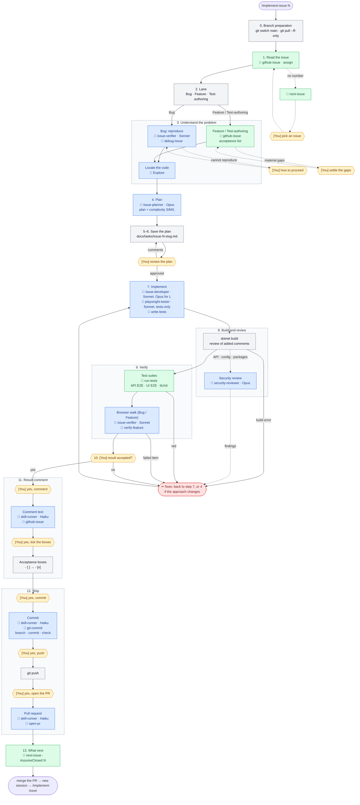

# AI harness of AddressBook2025

How the AI-assistant environment of this repository is built: what it consists of, how the issue workflow runs, why each stage uses the model it does, and how to keep it healthy. The harness serves two tools — **Claude Code** and **GitHub Copilot** — from one set of shared files. Its workflow, agents, rules, skills and benchmark were adapted from the GitHubBackup repository's harness (issue #184).

## Layout

```
CLAUDE.md                              single instruction hub, read by Claude Code and Copilot
.mcp.json                              MCP servers for Claude Code (context7, microsoft-learn, nuget)
.vscode/mcp.json                       MCP servers for Copilot in VS Code (github + the same three)
.ai/
  customizations.policy.json           layout and mirroring rules (audited by check.ps1)
  prompts/implement-issue.md           the workflow body, shared by both tools
  prompts/implement-issues.md          the batch workflow body (several issues, one branch)
  benchmarks/harness/                  harness benchmark: fixtures, history, reports
.github/
  instructions/*.instructions.md       file-type standards (source of truth; Copilot applies them via applyTo)
  skills/                              skills (source of truth)
  prompts/implement-issue.prompt.md    Copilot wrapper of the workflow
  prompts/implement-issues.prompt.md   Copilot wrapper of the batch workflow
  agents/*.agent.md                    Copilot agents (full set)
.claude/
  skills/                              byte-for-byte mirror of .github/skills
  commands/implement-issue.md          Claude Code wrapper of the workflow
  commands/implement-issues.md         Claude Code wrapper of the batch workflow
  agents/*.md                          Claude Code agents (curated subset + workflow agents)
  rules/*.md                           path-scoped rules: pointers to .github/instructions
  settings.json                        shared permissions, attribution off, MCP servers enabled
docs/
  specs/                               specifications (API, Contracts, Web, Architecture)
  tasks/                               one plan per issue: issue-<n>-<slug>.md
  ai-harness.md                        this document
```

The layout is checked with `pwsh -File .github/skills/_local.sync-ai-customizations/scripts/check.ps1`.

## The issue workflow: `/implement-issue <n>`

One command takes any issue end to end. The issue's labels select the **lane**: `bug` → Bug lane; tests-only work (typically `testing`) → Test-authoring lane; everything else → Feature lane.

The body is `.ai/prompts/implement-issue.md`. The diagram below shows who does what at each step. Legend:

- `<session>` — the main session, on whatever model it was started with;
- agents have their model written out: it is set in `.claude/agents/*.md` and does not depend on the session's model (see [Agents and models](#agents-and-models));
- 🤖 — an agent call (`.claude/agents/`);
- 🧩 — a skill (`.claude/skills/`);
- **[You]** — a point where the process waits for the user.

```
/implement-issue 42
│
├─ 0. Branch preparation ─────────── <session>: git status → git switch main → git pull --ff-only
│                                    (uncommitted changes → stop, ask you; staying on the
│                                     current branch only when you said so)
├─ 1. Read the issue ─────────────── <session>: 🧩 github-issue (body, comments, sub-issues)
│                                    (no number → 🧩 next-issue → [You] pick an issue)
│                                    (closed issue → stop)
│                                    (open blocker → stop, ask you)
│                                    gh issue edit --add-assignee @me
├─ 2. Lane ───────────────────────── <session>: label bug → Bug · tests only → Test-authoring
│                                    · else Feature (labels and text disagree → [You])
│
├─ 3. Understand the problem
│    ├─ Bug:  <session> ──▶ 🤖 issue-verifier (Sonnet), reproduce mode, + 🧩 debug-issue
│    │          ◀── repro table (or a failing Playwright API spec)
│    │          (cannot reproduce → [You])
│    ├─ Feature / Test-authoring: <session>: 🧩 github-issue → acceptance list
│    │          (material gaps → [You])
│    └─ All lanes: <session> ──▶ 🤖 Explore (summary ≤ 30 lines): locate the code
│
├─ 4. Plan ──────────────────────────────────▶ 🤖 issue-planner (Opus, read-only)
│                                    (large cross-layer change → optional 🤖 architect, Opus)
│                                    ◀── plan text + complexity S/M/L
├─ 5–6. Save and review ──────────── <session>: docs/tasks/issue-42-<slug>.md
│                                    [You] review → edits → review again
│                                    [You] /compact (ready-made command)
│
├─ 7. Implement
│    ├─ Bug / Feature: <session> ──▶ 🤖 issue-developer (Sonnet · Opus for L)
│    ├─ Test-authoring: <session> ──▶ 🤖 playwright-tester (Sonnet) for Playwright specs
│    │                                🤖 issue-developer (Sonnet) for bUnit
│    │                  tests via 🧩 write-tests · docs updated in the same change
│    │                  ◀── change summary (no commits)
│    └─ (tests reveal a broken behaviour in Test-authoring → stop, [You])
│
├─ 8. Build and review
│    ├─ <session>: stop background servers · dotnet build -clp:ErrorsOnly
│    ├─ <session>: review of the comments the change adds
│    └─ if API / validators / data access / Program.cs / config / packages changed:
│         <session> ──▶ 🤖 security-reviewer (Opus) ◀── findings → fixes
│
├─ 9. Verify
│    ├─ <session>: 🧩 run-tests (Playwright API and UI E2E; bUnit when Web changed)
│    ├─ Bug / Feature: <session> ──▶ 🤖 issue-verifier (Sonnet), verify mode, + 🧩 verify-feature
│    │                  real browser: every acceptance item (or the repro), console, network
│    │                  ◀── evidence table
│    │                  (Test-authoring: no browser walk)
│    ├─ red or failed item → back to 7 (or 4 if the approach changes), then 8–9 again
│    └─ [You] /compact
├─ 10. Confirm the result ────────── <session>: result table (acceptance, or root cause)
│                                    [You] "result accepted?" → /compact
│                                    (not accepted → back to 7 or 4)
│
├─ 11. Result comment
│    ├─ [You] "yes, post the comment"
│    │    <session> ──▶ 🤖 skill-runner (Haiku) drafts the text
│    │    <session>: 🧩 github-issue → gh issue comment
│    └─ [You] "yes, tick the acceptance boxes" → <session>: - [ ] → - [x] in the issue body
│
├─ 12. Ship
│    ├─ <session>: git fetch; origin/main moved → git pull --ff-only and repeat 8–9
│    ├─ <session>: ticks the plan checklist
│    ├─ [You] "yes, commit"
│    │    <session> ──▶ 🤖 skill-runner (Haiku) drafts the message
│    │    <session>: 🧩 git-commit → branch 42-<slug> → git commit → git log -1 check
│    ├─ [You] "yes, push" → <session>: git push -u origin 42-<slug>
│    ├─ [You] "yes, open the PR"
│    │    <session> ──▶ 🤖 skill-runner (Haiku) drafts title and description
│    │    <session>: 🧩 open-pr → PR into main
│    └─ <session>: gh pr checks (once, no polling)
│
└─ 13. What next ─────────────────── <session>: 🧩 next-issue -AssumeClosed 42
                                     → "merge the PR → new session → /implement-issue N"
```

The same flow as a diagram (GitHub renders Mermaid), without `/compact` and the small commands, which are in the tree above. Grey blocks are the main session, blue are agents, green are skills, yellow are waits for the user, red is a return to implementation.



The process waits for the user:

- on a pick when no issue number was given, a blocked or closed issue, a lane conflict, an irreproducible bug, or a material gap in the requirement (steps 0–3);
- on the plan review (steps 5–6);
- on the result confirmation (step 10);
- before each outward action: the issue comment, the acceptance boxes, the commit, the push and the pull request (steps 11–12) — each needs its own "yes";
- on the three ready-made `/compact` commands (after steps 6, 9 and 10), which may be skipped while the conversation is short.

`/implement-issues` runs this same cycle for several issues on one branch; it is described in [Batches](#batches-implement-issues-n-n-) and has no diagram of its own.

Context economy is built in: three `/compact` milestones with ready focus texts, a runaway guard, one issue per session, narrow reads, small tool output, and noisy work delegated to agents.

## Batches: `/implement-issues <n> <n> …`

For small issues the per-issue review stops cost more than the work. `/implement-issues 191 192 193` runs the `implement-issue` workflow for each issue in the given order on **one branch** (`<first>-<last>-<slug>`, created at the first commit, not earlier), one commit per issue (`#<n> <title>`), then verifies the branch once and ships **one pull request**. The batch body does not copy the workflow: it refers to `implement-issue.md` and lists only the differences, so a change to the workflow reaches the batch too.

| Aspect | Behaviour |
|---|---|
| Stops | None by default. The batch halts on an unsettled question, an open blocker that is not earlier in the list, a closed issue, a plan of complexity `L`, a failed reproduction, or a failure two fixes do not resolve. `--review-plans` restores the plan-review stop |
| Debatable decisions | Made, recorded in each plan's *Decisions* and reported together at the end |
| Per issue | Plan, implementation, build and the affected tests, commit (starting the batch authorises the commits) |
| Once at the end | Full suites, browser walk of every acceptance item, UI E2E, `security-reviewer` on the branch diff when the batch touches API, configuration, packages, the Web error pipeline or server-provided text; fixes go in further commits under their issue |
| Ship | One confirmation of the result; then comments, push and PR, each after the user's go-ahead, or without further prompts with `--ship`. The PR has one `Closes #<n>` line per issue |
| Limits | At most 5 issues of complexity S or M; never amend or rewrite a commit of the batch |

## Issue order: `next-issue`

`.github/skills/_local.next-issue/scripts/Get-NextIssue.ps1` reads all open issues with one GraphQL query and lists the ready ones: no open pull request and every "blocked by" issue closed, ordered by issue number (issues of one plan are created in plan order). `-AssumeClosed <n>` treats an issue as closed, so the workflow can recommend the next issue before the current PR merges. Dependencies must be recorded as GitHub "blocked by" relations for the order to hold.

## Agents and models

| Agent | Model | Why this model |
|---|---|---|
| `issue-planner` | Opus | A planning mistake is the most expensive one: it is multiplied by implementation, review and rework |
| `issue-developer` | Sonnet; Opus for complexity `L` | Implementing an approved plan is well-specified work; `L` (migration, contract ripple, validation/security logic, > ~8 files) gets the stronger model |
| `issue-verifier` | Sonnet | Browser walks are mechanical but produce huge snapshots; isolating them keeps the main context small |
| `security-reviewer` | Opus | Rare, and finding a real issue needs the strongest reasoning |
| `skill-runner` | Haiku | Drafts commit messages, issue comments and PR text in a fixed format from compact facts; the main session still invokes the matching skill (`git-commit`, `github-issue`, `open-pr`) before acting |
| `architect` | Opus | Design questions on cross-layer changes |
| `playwright-tester` | Sonnet | Test-authoring lane: explores the UI with Playwright MCP and writes specs |

The main session keeps every gate: plan review, build, test runs, both confirmations, and every `git` / GitHub action. A subagent's "passed" is input, not proof. Copilot cannot override a subagent's model per call, so there an `L` plan is implemented in the main session. Agent parity between `.claude/agents` and `.github/agents` is manual.

## Rules (`.claude/rules/`)

Claude Code loads a rule when it works with a file matching the rule's `paths:`. Five rules are thin pointers that tell the assistant to read a `.github/instructions/*` file before editing, so the standard stays in one place and loads only when needed (an `@`-import would be expanded at session start — the first benchmark showed ~3k tokens in every session): `api-architecture.md`, `csharp.md`, `blazor.md`, `playwright.md`, `bunit.md`. Their `paths:` mirror the instruction's `applyTo` — change both together. Three rules carry their own content: `update-docs-on-code-change.md` (which document each kind of change updates), `docs.md` (where documents go, plan format, style) and `github-actions.md` (workflow security and CI conventions). Directory-scoped `CLAUDE.md` files (`src/UiTests`, `src/AddressBook.Web.Tests`) add project-specific non-negotiables.

## Skills

Repository-local skills (`_local.*`, invoked as `/<name>`):

| Skill | Purpose |
|---|---|
| `github-issue` | Read an issue; post the result comment for the lane |
| `run-api`, `run-tests` | Start the API; run the Playwright API suite |
| `verify-feature` | Start API + Web and walk acceptance items in a browser |
| `open-pr`, `git-commit` | Commit and pull-request conventions |
| `next-issue` | Recommend the next issue |
| `write-tests` | Pick the test layer (Playwright API / bUnit / Playwright UI) and write the tests |
| `debug-issue` | Reproduce and find the root cause of a defect |
| `refactor-code` | Behaviour-preserving refactoring |
| `nuget-package-update` | Pin-aware NuGet updates through `src/Directory.Packages.props`, family by family, with a build and test gate after each step |
| `harness-quality-check` | Benchmark the harness (manual only) |
| `sync-ai-customizations` | Audit the cross-tool layout |

Generic skills (`aspnet-core`, `ef-core`, `security-owasp`, `update-docs`, `code-review-checklist`, `dotnet-run-tests`, `test-anti-patterns`, `coverage-analysis`, `directory-build-organization`, …) are loaded on demand instead of sitting in every context. Rarely needed ones — `coverage-analysis`, `directory-build-organization`, `test-anti-patterns`, `create-specification`, `dotnet-timezone`, `harness-quality-check` — set `disable-model-invocation: true`: their descriptions stay out of the start context, and they run only when invoked as `/<name>`. `dotnet-run-tests` is the upstream `run-tests` skill, renamed because `_local.run-tests` owns that name.

## MCP servers

| Server | Used for |
|---|---|
| `microsoft-learn` | Official .NET, ASP.NET Core, EF Core and Azure documentation and code samples (`microsoft-docs` skill, `issue-planner`, `issue-developer`) |
| `context7` | Documentation of third-party libraries: MudBlazor, FluentValidation, MediatR, bUnit, Playwright |
| `nuget` | Package versions, vulnerabilities and release information (`nuget-package-update`); runs through `dnx`, which needs the .NET 10 SDK |
| `github` | Issues and pull requests — in the Copilot config only; Claude Code uses `gh` or the user's own GitHub MCP server |

Claude Code asks each user once to approve the project servers in `.mcp.json`.

## Permissions

`.claude/settings.json` is shared through git:

- **allow** — build, tests, running the API and the Web app, `git` and `gh` reads, the shipping commands (`git add`/`commit`/`push`, `gh pr create`, `gh issue comment`/`edit`), the `_local.*` scripts, and the documentation MCP servers. Commit, push and PR stay gated by instruction: the assistant does them only when the user asks (`CLAUDE.md`);
- **ask** — merging, PR comments and edits, creating or closing issues, GitHub API writes, `dotnet ef database`;
- **deny** — force-push, `reset --hard`, `git clean`, `rm -rf`, and reading `.env` or local `appsettings.*.local.json` secrets.

It also turns off the automatic commit and PR attribution (commit messages follow the `git-commit` skill) and enables the `.mcp.json` servers. Personal overrides go to `.claude/settings.local.json`, which git ignores.

## Harness benchmark

The `harness-quality-check` skill starts fixed `claude -p` sessions and records the start context, the tokens a file read adds, the rules loaded, and a judge's score against a ground truth. History: `.ai/benchmarks/harness/run-history.csv`; reports: `.ai/benchmarks/harness/reports/`. Fixtures: `bench-base` (start context by area) and `quality-vertical-slice` (a feature request answered with the full slice, validation, tests and open decisions). Run it after changing `CLAUDE.md`, rules, skills, agents, MCP servers or settings; it uses part of the usage limit.

## Maintenance

When `CLAUDE.md`, `.claude/**`, `.github/{agents,skills,prompts,instructions}/**`, `.ai/**` or `.mcp.json` change, update this document in the same change, run the layout audit, and preferably the benchmark.
