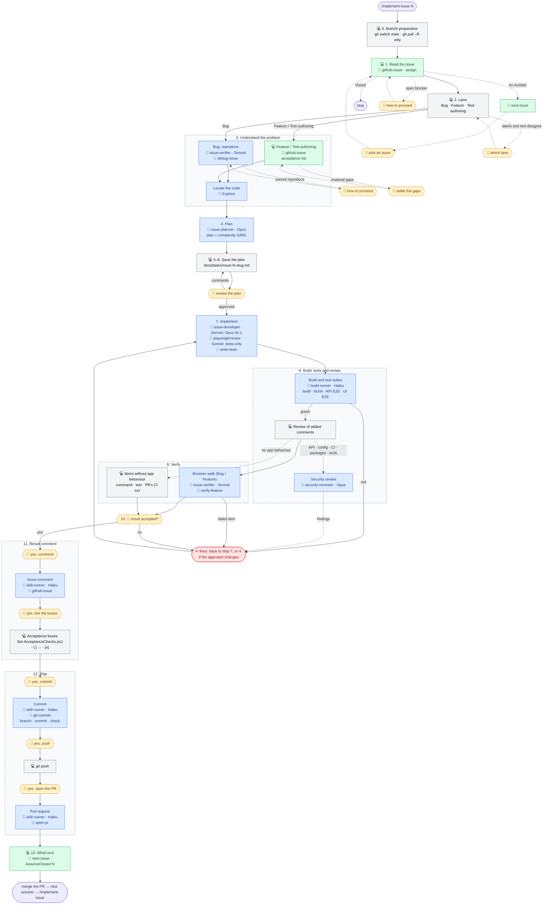

# The implement-issue workflow: `/implement-issue 42`

One command takes any issue end to end. The issue's labels select the **lane**: `bug` → Bug lane; tests-only work (typically `testing`) → Test-authoring lane; everything else → Feature lane (a change to CI workflows, configuration or documentation is Feature, even when labelled `testing`).

The body is `.ai/prompts/implement-issue.md`, shared by both tools; `.claude/commands/implement-issue.md` (Claude Code) and `.github/prompts/implement-issue.prompt.md` (Copilot) are thin wrappers around it. The diagram below shows who does what at each step. Legend:

- 💻 — the main session, on whatever model it was started with;
- agents have their model written out: it is set in `.claude/agents/*.md` and does not depend on the session's model (see [Agents and models](README.md#agents-and-models));
- 🤖 — an agent call (`.claude/agents/`);
- 🧩 — a skill (`.claude/skills/`);
- 🙋 — a point where the process waits for the user.

```
/implement-issue 42
│
├─ 0. Branch preparation ─────────── 💻 git status → git switch main → git pull --ff-only
│                                    (uncommitted changes → stop, ask you; staying on the
│                                     current branch only when you said so)
├─ 1. Read the issue ─────────────── 💻 🧩 github-issue (body, comments, sub-issues)
│                                    (no number → 🧩 next-issue → 🙋 pick an issue)
│                                    (closed issue → stop)
│                                    (open blocker → stop, 🙋 how to proceed)
│                                    gh issue edit --add-assignee @me
├─ 2. Lane ───────────────────────── 💻 label bug → Bug · tests only → Test-authoring
│                                    · else Feature (labels and text disagree → 🙋)
│
├─ 3. Understand the problem
│    ├─ Bug: 💻 ──▶ 🤖 issue-verifier (Sonnet), reproduce mode, + 🧩 debug-issue
│    │          ◀── repro table (or a failing Playwright API spec)
│    │          (cannot reproduce → 🙋)
│    ├─ Feature / Test-authoring: 💻 🧩 github-issue → acceptance list
│    │          (material gaps → 🙋)
│    └─ All lanes: 💻 ──▶ 🤖 Explore (summary ≤ 30 lines): locate the code
│
├─ 4. Plan ──────────────────────────────────▶ 🤖 issue-planner (Opus, read-only)
│                                    (large cross-layer change → optional 🤖 architect, Opus)
│                                    ◀── plan text + complexity S/M/L
├─ 5–6. Save and review ──────────── 💻 docs/tasks/issue-42-<slug>.md
│                                    🙋 review → edits → review again
│                                    🙋 /compact (ready-made command)
│
├─ 7. Implement
│    ├─ Bug / Feature: 💻 ──▶ 🤖 issue-developer (Sonnet · Opus for L)
│    ├─ Test-authoring: 💻 ──▶ 🤖 playwright-tester (Sonnet) for Playwright specs
│    │                         🤖 issue-developer (Sonnet) for bUnit
│    │                  tests via 🧩 write-tests · docs updated in the same change
│    │                  ◀── change summary (no commits)
│    └─ (tests reveal a broken behaviour in Test-authoring → stop, 🙋)
│
├─ 8. Build, tests and review
│    ├─ 💻 stop background servers
│    ├─ 💻 ──1 call──▶ 🤖 build-runner (Haiku), scope full
│    │                  dotnet build -clp:ErrorsOnly
│    │                  bUnit · Playwright API · Playwright UI E2E (output to files;
│    │                  the Playwright suites start API and Web themselves)
│    │    💻 ◀── verbatim summary lines + first errors
│    │    (red → errors to 🤖 issue-developer → 🤖 build-runner again)
│    ├─ 💻 review of the comments the change adds
│    ├─ if API / validators / data access / Program.cs / config / CI workflows / packages / tools changed:
│    │    💻 ──▶ 🤖 security-reviewer (Opus) ◀── findings → fixes
│    └─ (build-runner and the triggered review are skipped only on your explicit word)
│
├─ 9. Verify
│    ├─ Bug / Feature: 💻 ──▶ 🤖 issue-verifier (Sonnet), verify mode, + 🧩 verify-feature
│    │                  real browser: every acceptance item with behaviour visible in the app
│    │                  (or the repro), console, network
│    │                  ◀── evidence table
│    │                  (skipped only on your explicit word for this issue)
│    ├─ Feature, item without app behaviour (CI workflow, configuration, documentation):
│    │    💻 command, test or the PR's CI run (an item only CI can confirm stays open)
│    ├─ Test-authoring: no browser walk; the new tests in the build-runner summary
│    │    must pass and assert the intended behaviour
│    ├─ red or failed item → back to 7 (or 4 if the approach changes), then 8–9 again
│    └─ 🙋 /compact
├─ 10. Confirm the result ────────── 💻 result table (acceptance, or root cause)
│                                    🙋 "result accepted?" → /compact
│                                    (not accepted → back to 7 or 4)
│
├─ 11. Result comment
│    ├─ 🙋 "yes, post the comment"
│    │    💻 ──1 call──▶ 🤖 skill-runner (Haiku) + 🧩 github-issue
│    │                    text → gh issue comment --body-file
│    │    💻 ◀── comment URL
│    └─ 🙋 "yes, tick the acceptance boxes" → 💻 Set-AcceptanceChecks.ps1 (- [ ] → - [x])
│
├─ 12. Ship
│    ├─ 💻 git fetch; origin/main moved → git pull --ff-only and repeat 8–9 (🤖 build-runner)
│    ├─ 💻 ticks the plan checklist and the issue's task in docs/tasks/*-plan.md, if there is one
│    ├─ 🙋 "yes, commit"
│    │    💻 ──1 call──▶ 🤖 skill-runner (Haiku) + 🧩 git-commit
│    │                    creates branch 42-<slug>
│    │                    git add <the given list>
│    │                    writes the text → git commit -F
│    │                    git log -1 → --amend on a deviation
│    │    💻 ◀── "a1b2c3d #42 Title"
│    ├─ 🙋 "yes, push" → 💻 git push -u origin 42-<slug>
│    ├─ 🙋 "yes, open the PR"
│    │    💻 ──1 call──▶ 🤖 skill-runner (Haiku) + 🧩 open-pr
│    │                    text → gh pr create --body-file
│    │    💻 ◀── PR URL
│    └─ 💻 gh pr checks (once, no polling; a failed check → fix on the same branch after your yes)
│
└─ 13. What next ─────────────────── 💻 🧩 next-issue -AssumeClosed 42
                                     → "merge the PR → new session → /implement-issue N"
```

The same flow as a Mermaid diagram (GitHub renders it), without `/compact` and the small commands, which are in the tree above. Grey blocks are the main session, blue are agents, green are skills, yellow are waits for the user, red is a return to implementation.



The process waits for the user:

- on uncommitted changes in the working tree, a pick when no issue number was given, an open blocker, a lane conflict, an irreproducible bug, or a material gap in the requirement (steps 0–3); a closed issue stops the run;
- on the plan review (steps 5–6);
- on the result confirmation (step 10);
- before each outward action: the issue comment, the acceptance boxes, the commit, the push and the pull request (steps 11–12) — each needs its own "yes";
- on the three ready-made `/compact` commands (after steps 6, 9 and 10), which may be skipped while the conversation is short.

Context economy is built in: three `/compact` milestones with ready focus texts, a runaway guard, one issue per session, narrow reads, small tool output, and noisy work delegated to agents.

Several small issues on one branch are described in [implement-issues](implement-issues.md).
