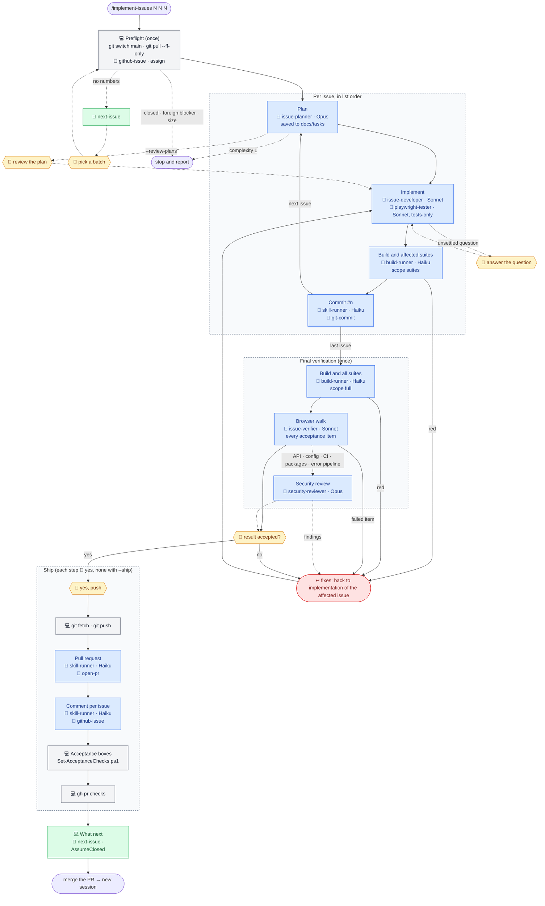

# The implement-issues workflow: `/implement-issues 191 192 193`

For small issues the per-issue review stops cost more than the work. The command runs the [`/implement-issue`](implement-issue.md) cycle for each issue in the given order on **one branch** (`<first>-<last>-<slug>`, created at the first commit, not earlier), one commit per issue (`#<n> <title>`), then verifies the branch once and ships **one pull request**. Optional flags: `--review-plans` restores the plan-review stop per issue; `--ship` pre-authorises the push, the pull request, the issue comments and the acceptance ticks. With no issue numbers the command recommends a batch with the `next-issue` skill.

The body is `.ai/prompts/implement-issues.md`, shared by both tools; `.claude/commands/implement-issues.md` (Claude Code) and `.github/prompts/implement-issues.prompt.md` (Copilot) are thin wrappers around it. The body does not copy the `implement-issue` workflow: it refers to it and lists only the differences, so a change to the workflow reaches the batch too. Legend:

- 💻 — the main session, on whatever model it was started with;
- agents have their model written out: it is set in `.claude/agents/*.md` and does not depend on the session's model (see [Agents and models](../ai-harness.md#agents-and-models));
- 🤖 — an agent call (`.claude/agents/`);
- 🧩 — a skill (`.claude/skills/`);
- 🙋 — a point where the process waits for the user.

```
/implement-issues 191 192 193 [--review-plans] [--ship]
│
├─ Preflight (once) ──────────────── 💻 git status → git switch main → git pull --ff-only
│                                    (uncommitted changes → stop)
│                                    (no numbers → 🧩 next-issue → 🙋 pick a batch)
│                                    🧩 github-issue: every issue, lanes from the labels
│                                    (closed issue → stop)
│                                    (open blocker not earlier in the list → stop)
│                                    (limit: 5 issues of complexity S or M)
│                                    gh issue edit --add-assignee @me
│
├─ Per issue, in list order
│    ├─ 💻 ──▶ 🤖 issue-planner (Opus, read-only) ◀── plan + complexity S/M/L
│    │          (L → stop; the plan is saved and the run goes on)
│    │          (--review-plans → 🙋 review the plan)
│    ├─ 💻 ──▶ 🤖 issue-developer (Sonnet)
│    │          🤖 playwright-tester (Sonnet) for Playwright specs in the Test-authoring lane
│    │          ◀── change summary (no commits)
│    │          (unsettled question → stop, 🙋; debatable choice → recorded in the plan's
│    │           Decisions and in the running list, no stop)
│    ├─ 💻 review of the comments the change adds
│    ├─ 💻 ──1 call──▶ 🤖 build-runner (Haiku), scope suites (no UI E2E)
│    │          (red → back to implementation; no red commits)
│    └─ 💻 ──1 call──▶ 🤖 skill-runner (Haiku) + 🧩 git-commit
│               the first commit creates the branch <first>-<last>-<slug>
│               ◀── "a1b2c3d #191 Title"
│
├─ Final verification (once) ─────── on git diff main...HEAD
│    ├─ 💻 ──1 call──▶ 🤖 build-runner (Haiku), scope full
│    ├─ 💻 ──▶ 🤖 issue-verifier (Sonnet), verify mode: every acceptance item of every issue
│    ├─ if API / validators / data access / Program.cs / config / CI workflows / packages / tools /
│    │  Web error pipeline / server-provided text changed:
│    │    💻 ──▶ 🤖 security-reviewer (Opus) ◀── findings
│    └─ failure or finding → fix as an additional commit under its issue, then re-run the checks
│
├─ Report and confirmation ───────── 💻 table: issue → commit → acceptance → verification → result
│                                    💻 list of debatable decisions, gaps
│                                    🙋 "result accepted?" (no → fix the issue, verify again)
│
├─ Ship (each step 🙋 "yes", none with --ship)
│    ├─ 💻 git fetch; origin/main moved → git pull --ff-only and repeat the final verification
│    ├─ 💻 git push -u origin <branch>
│    ├─ 💻 ──1 call──▶ 🤖 skill-runner (Haiku) + 🧩 open-pr: one PR, one "Closes #<n>" per issue
│    ├─ 💻 ──1 call per issue──▶ 🤖 skill-runner (Haiku) + 🧩 github-issue: comment linking the PR
│    │    💻 Set-AcceptanceChecks.ps1 per issue (- [ ] → - [x])
│    └─ 💻 gh pr checks (once, no polling)
│
└─ What next ─────────────────────── 💻 🧩 next-issue -AssumeClosed <every issue of the batch>
                                     → "merge the PR → new session → /implement-issue(s)"
```

The same flow as a Mermaid diagram, without the small commands, which are in the tree above. Grey blocks are the main session, blue are agents, green are skills, yellow are waits for the user, red is a return to implementation.



The batch stops and reports, leaving all finished commits in place, on: an unsettled question, an open foreign blocker, a closed issue, a plan of complexity `L`, a failed reproduction (Bug lane), a build or test failure that two fix attempts do not resolve, or a change that would need to touch an earlier issue's commit in a way that is not a plain follow-up. A commit of the batch is never amended or rewritten; fixes go forward.

The process waits for the user:

- on uncommitted changes, a batch pick when no numbers were given, or an unsettled question (preflight and per issue);
- on the plan review per issue, only with `--review-plans`;
- on the result confirmation of the whole batch;
- before each outward action: the push, the pull request, the issue comments and the acceptance ticks — each needs its own "yes", unless `--ship` pre-authorises them. Starting the batch authorises the commits, one per issue.

Debatable decisions are made, recorded in each plan's *Decisions* section and reported together at the end. The batch takes at most 5 issues of complexity S or M.
