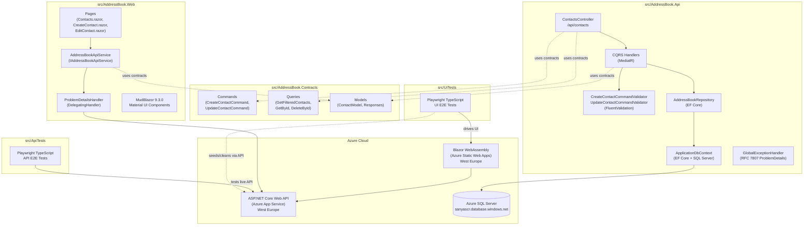
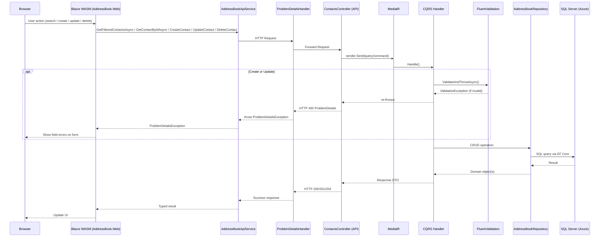
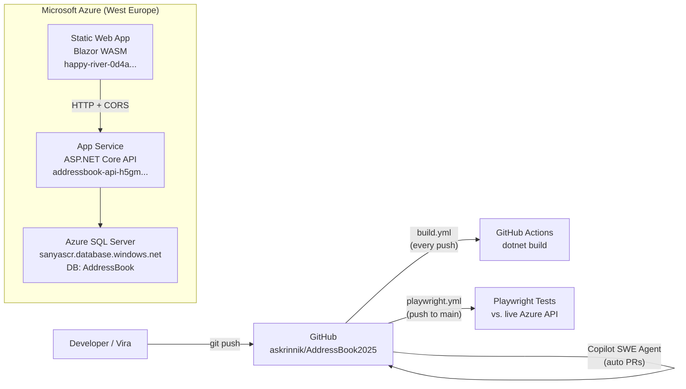

# Research Report: `askrinnik/AddressBook2025`

> **Repo:** [askrinnik/AddressBook2025](https://github.com/askrinnik/AddressBook2025)  
> **Head commit:** `b2aa3f742b5f21ede8ab8dc3a0b8993ad55f8c73`  
> **Report date:** 2026-05-05  
> **Last updated:** 2026-05-26 — corrected CORS, exception handler, and Scalar documentation; added spec document references; marked Issue #50 as resolved

---

## Executive Summary

`AddressBook2025` is a full-stack, cloud-hosted pet/learning project that implements a contact management (address book) application. It is written in **C# / .NET 10**, with a **Blazor WebAssembly** frontend (MudBlazor UI), an **ASP.NET Core Web API** backend following a clean CQRS + MediatR architecture, a shared contracts library, and a **Playwright/TypeScript** end-to-end test suite. The application is deployed on **Microsoft Azure** (App Service for the API, Azure Static Web Apps for the Blazor UI, Azure SQL for data). Development is collaborative between two contributors (Alexander Skrinnik and Vira Skrynnik), with extensive use of **GitHub Copilot coding agent** for automated PR creation and feature implementation. The project has been consistently maintained with 36 tracked issues, 14 pull requests, and active CI/CD via GitHub Actions.

---

## Business Context

> *Source: legacy BRD and FRS documents (consolidated May 2026)*

**Goal:** Create an intuitive tool for managing and storing a user's address book.

### In Scope

- CRUD operations for contacts
- Grouping / categorizing contacts
- Search and filtering
- User authentication and access control
- Data import / export
- Secure data storage and backup

### Out of Scope

- Integration with third-party services (social networks, CRM systems)
- Multi-user collaboration features
- Mobile application development

### Compliance

- Must comply with data-protection regulations (GDPR, CCPA)

### Success Criteria

- Users can manage contacts without technical expertise
- Data is securely stored and retrieved efficiently
- System performs well under normal and peak usage
- UI/UX is user-friendly and meets accessibility standards

### Business Rules (from FRS)

- Each contact must have at least one identifying field (`FirstName` or `LastName`)
- Phone numbers must be unique per contact
- String field max lengths: `FirstName` 30, `LastName` 30, `PhoneNumber` 20 (FRS) / 15 (current code), `Phone.Comment` 200, `PhoneOperator.Name` 30, `PhoneOperator.Description` 200
- Birthday cannot be in the future

### Future Enhancements (from FRS)

- Support for email addresses
- Integration with external contact synchronization services
- Custom categories for contacts

---

## Key Repositories Summary

| Repository | Language | Purpose |
|---|---|---|
| [askrinnik/AddressBook2025](https://github.com/askrinnik/AddressBook2025) | C# / TypeScript | Full-stack contacts app: API + Blazor UI + E2E tests |

---

## Architecture Overview



---

## Project Structure

```
askrinnik/AddressBook2025/
├── .github/
│   ├── agents/                      # Custom agent definitions (GitHub Copilot)
│   ├── instructions/                # Path-scoped coding standards (applyTo globs)
│   ├── prompts/                     # Copilot command wrappers (*.prompt.md)
│   ├── skills/                      # Reusable skills (source of truth; _local.* = repo-local)
│   ├── ISSUE_TEMPLATE/
│   └── workflows/
│       ├── build.yml                # CI: dotnet build on every push
│       ├── api-tests.yml            # API E2E (src/ApiTests) on every push + dispatch
│       ├── ui-tests.yml             # UI E2E (src/UiTests) on every push + dispatch
│       └── security.yml             # NuGet/npm vulnerability scan
├── .ai/
│   ├── customizations.policy.json   # Cross-tool skills/prompts sync policy
│   └── prompts/                     # Shared, tool-neutral command bodies
├── .claude/
│   ├── agents/                      # Claude Code agents (curated subset of .github/agents)
│   ├── commands/                    # Claude command wrappers (/<name>)
│   └── skills/                      # Byte-for-byte mirror of .github/skills
├── CLAUDE.md                        # Single instruction hub (read by Claude Code + Copilot)
├── docs/
│   ├── specs/                       # Per-project technical specifications
│   │   ├── AddressBook.Api.md
│   │   ├── AddressBook.Contracts.md
│   │   ├── AddressBook.Web.md
│   │   └── Architecture.md
│   └── tasks/                       # Implementation plans (e.g. ui-tests-framework-plan.md)
├── src/
│   ├── AddressBook.slnx              # VS 2022 solution file
│   ├── AddressBook.Api/             # ASP.NET Core Web API
│   ├── AddressBook.Contracts/       # Shared MediatR contracts (DTOs)
│   ├── AddressBook.Web/             # Blazor WebAssembly SPA (code-behind: Contacts.razor.cs)
│   ├── ApiTests/                    # Playwright TypeScript API E2E tests
│   └── UiTests/                     # Playwright TypeScript UI E2E tests
└── README.md                        # Minimal: "pet project for address book development"
```

---

## Component Deep-Dives

### 1. `AddressBook.Contracts` — Shared Contracts Library

Thin shared library defining MediatR request/response types and DTOs, referenced by both the API and Web projects. Contains 5 commands/queries and 5 response/model records.

→ Full specification: [`AddressBook.Contracts.md`](./AddressBook.Contracts.md)

---

### 2. `AddressBook.Api` — ASP.NET Core Web API

CQRS + MediatR backend with FluentValidation, EF Core 10 / SQL Server, strongly-typed value-object IDs, and RFC 7807 error responses via `GlobalExceptionHandler`.

**API Endpoint Summary:**

| Method | Route | Success | Error |
|---|---|---|---|
| GET | `/api/contacts?search=text` | 200 `GetFilteredContactsResponse` | — |
| GET | `/api/contacts/{id}` | 200 `ContactModel` | 404 |
| POST | `/api/contacts` | 201 + `Location` header | 400 (validation) |
| PUT | `/api/contacts/{id}` | 204 No Content | 404, 400 (validation) |
| DELETE | `/api/contacts/{id}` | 204 No Content | 404 |

→ Full specification: [`AddressBook.Api.md`](./AddressBook.Api.md)

---

### 3. `AddressBook.Web` — Blazor WebAssembly Frontend

MudBlazor 9.3.0 Material Design UI with typed `HttpClient`, `ProblemDetailsHandler` error pipeline, and 4 pages: `/contacts` (table with search/sort/edit/delete), `/create-contact`, `/edit-contact/{id}`, `/` (home). Deployed as Azure Static Web App.

→ Full specification: [`AddressBook.Web.md`](./AddressBook.Web.md)

---

### 4. `ApiTests` & `UiTests` — Playwright/TypeScript E2E Tests

Two independent Playwright + TypeScript suites. `src/ApiTests` covers the REST API (the five `Contacts` endpoints, negatives, boundaries, and contract schemas). `src/UiTests` is a hybrid UI E2E suite for the Blazor WASM frontend — it drives the real browser and seeds/cleans data fast over the API. Both start the app themselves via Playwright's `webServer` and run in CI (see below).

→ Full specifications: [`src/ApiTests/README.md`](../../src/ApiTests/README.md), [`src/UiTests/README.md`](../../src/UiTests/README.md)

---

### 5. CI/CD

**`build.yml`** — Triggers on every push; runs `dotnet restore` + `dotnet build --configuration Release` on `ubuntu-latest` with .NET 10.0.x.[^6]

**`api-tests.yml`** — Triggers on every push (and manual dispatch); runs the `src/ApiTests` API E2E suite on `ubuntu-latest`. Brings up a SQL Server 2022 service container, sets up .NET 10 and Node LTS, then `npm ci` + `npm test` — Playwright's `webServer` block starts the API (port 5000) itself, pointed at the container via `Database__*` env overrides. No browser install (the tests use `APIRequestContext`). Publishes the HTML report as an artifact (30 days); traces on failure.

**`ui-tests.yml`** — Triggers on every push (and manual dispatch); runs the `src/UiTests` UI E2E suite on `ubuntu-latest`. Brings up a SQL Server 2022 service container, sets up .NET 10 and Node LTS, generates an HTTPS dev cert, then `npm ci` + `npx playwright install --with-deps` + `npm test` — Playwright's `webServer` block starts the API (port 5000) and Web (`https://localhost:7187`) itself, with the API pointed at the container via `Database__*` env overrides. Publishes the HTML report as an artifact (30 days); traces/videos on failure.

**`security.yml`** — Triggers on push/PR to `main` and a weekly schedule; scans for vulnerable NuGet and npm packages.

> The legacy `playwright.yml` workflow and the reference-only `src/AutoTests` suite it ran were removed once CI moved to running the current API and UI suites entirely inside GitHub Actions.

---

### 6. AI Tooling Integration (Copilot + Claude Code)

The project demonstrates heavy Copilot coding agent use:[^8]

| PR | Author | Task |
|---|---|---|
| #51 (open draft) | `copilot-swe-agent[bot]` | Fix exception handler middleware order |
| #48 | `copilot-swe-agent[bot]` | Upgrade solution from .NET 9 → .NET 10 |
| #42 | `copilot-swe-agent[bot]` | Fix Azure SWA 404 on page refresh (`staticwebapp.config.json`) |
| #41 | `copilot-swe-agent[bot]` | Add future-birthday validation to `CreateContactCommandValidator` |

> **Updated 2026-08-15:** the AI-customizations layout below reflects the current repository, which has expanded beyond the commit this report otherwise pins to.

**Cross-tool AI customizations.** The repository shares its AI configuration across **GitHub Copilot** (`.github/`) and **Claude Code** (`.claude/`), governed by `.ai/customizations.policy.json`:[^9]

- **Root instructions** — `CLAUDE.md` is the single hub, read by both tools; it replaced the former one-line `.github/copilot-instructions.md`. It still carries the *"source code supports non-English comments"* rule (Russian-language comments are allowed) and points to the specs and instruction files rather than duplicating them.
- **File-type standards** — `.github/instructions/*.instructions.md`; Copilot auto-applies them via `applyTo` globs, while Claude Code reads them through the pointer table in `CLAUDE.md`.
- **Skills** — `.github/skills/` is the source of truth, mirrored byte-for-byte to `.claude/skills/`; repo-local workflow skills use the `_local.` prefix. A `sync-ai-customizations` skill audits parity (`check.ps1`).
- **Commands** — one shared body per command in `.ai/prompts/`, with thin wrappers in `.github/prompts/` (Copilot) and `.claude/commands/` (Claude): `implement-issue`, `fix-bug-issue`.
- **Agents** — `.github/agents/` holds the full Copilot set; a curated subset is translated into `.claude/agents/` for Claude Code (the rest of the roles are covered by Claude Code built-ins).

---

### 7. Documentation (`docs/`)

#### `docs/Old/` — Legacy documents

| Document | Language | Content |
|---|---|---|
| `01_Software_project_docs.md` | Russian | ChatGPT-generated pre-dev checklist (BRD, FRS, NFR, SAD, SRS, Test Plan) |
| `02_BRD.md` | English | Business Requirements — CRUD contacts, search/filter, web-based, no mobile/CRM integrations |
| `03_FRS.md` | English | Functional Spec — 3 entities (Contact, Phone, PhoneOperator), CRUD, field constraints (max 30 chars), future: emails/categories |
| `Azure_environment.md` | English | Azure deployment URLs, SQL server name, how to warm up the service |
| `How_to_run_from_console.md` | English | BAT script: `git pull` → `dotnet build` → `dotnet run --Database:Password=<PASSWORD>` |
| `Test plan.md` | Mixed | QA test plan document |

#### `docs/specs/` — Per-project technical specifications

| Document | Covers |
|---|---|
| `AddressBook.Contracts.md` | Commands, queries, models — full type signatures |
| `AddressBook.Api.md` | Domain, handlers, validation, data access, middleware, CORS, DB schema, build/run |
| `AddressBook.Web.md` | Pages, API service, error handling, MudBlazor components, layout, build/run |

---

### 8. Database Schema

3 tables (`Contacts`, `Phones`, `PhoneOperators`) with seed data. See the [Api specification](./AddressBook.Api.md#database-schema) for the full schema.

---

## Request Flow Diagram



---

## Deployment Architecture



### Deployment Operational Notes

- **API cold start:** The App Service may need a warm-up request before the UI is usable (initial request after idle triggers startup).
- **Blazor WASM client-side routing:** The Web UI includes `staticwebapp.config.json` in `wwwroot` to instruct Azure Static Web Apps to return `index.html` for all navigation requests (except static assets). This enables direct navigation and page refresh on routes like `/contacts` or `/create-contact`.
- **Local run with DB credentials:** Use `dotnet run --Database:Password=<PASSWORD>` to override the database password via CLI. See also `Database:Server` and `Database:User` overrides in [AddressBook.Api.md](./AddressBook.Api.md).

---

## Notable Design Decisions

| Decision | Detail |
|---|---|
| **Strongly-typed IDs** | All PKs are `sealed record` wrappers (`ContactId(int Value)`). EF Core uses `HasConversion` + `Unwrap()` SQL function trick to translate LINQ comparisons server-side.[^10] |
| **Interface Segregation for repo** | `AddressBookRepository` implements 5 interfaces, each registered separately as `AddScoped<IXxx>`. Handlers depend only on the interface they need.[^2] |
| **No authentication** | `UseAuthorization()` and `UseHttpsRedirection()` are commented out. `OwnerId.Default()` always returns `new(1)` — explicit single-tenant placeholder for future work.[^4] |
| **Swagger generation detection** | `Program.cs` detects `dotnet swagger tofile` to skip DB migration during OpenAPI spec generation.[^11] |
| **`DeleteContactByIdQuery` naming** | Named a "Query" but performs a delete mutation — acknowledged naming inconsistency in the codebase.[^12] |
| **`CreateContactCommand` / `UpdateContactCommand` are classes** | Unlike all other contracts which are `record` types, these two mutable commands are `class` — unusual for commands but consistent with each other.[^1] |
| **Client-side pagination** | `GetFilteredContactsResponse` includes `TotalRows`, but sorting/paging is done client-side in `Contacts.razor` (not server-side). `TotalRows` is wired to MudTable's `TotalItems`.[^5] |

---

## Issues & Development History

### Resolved Issues (previously open)

| # | Title | Resolution |
|---|---|---|
| **#50** | Handle exceptions in API | Fixed — `UseExceptionHandler` moved to first position in pipeline; PR #51 merged[^3] |

### Completed Feature Milestones (closed issues)

| Phase | Issues |
|---|---|
| Onboarding & Setup | #1–#9: GH account setup, software install, Git config for Vira |
| Documentation | #3, #10: BRD/FRS docs, test documentation |
| API Development | #11, #14, #21, #29: GET list, POST create, GET by ID, DELETE by ID |
| UI Development | #15, #30, #32, #38: Contacts page, Delete button, Create page, MudBlazor migration |
| Bug Fixes (API) | #16, #18, #23–#25, #27–#28: Search bugs, HTML body instead of JSON, 500→400 for long names |
| Bug Fixes (UI) | #26, #31, #33–#35, #37: Column title typo, delete dialog text, birthday display, 404 on refresh, autofill overlap |
| Enhancements | #36: Future birthday validation |
| Upgrades | #47: .NET 9 → .NET 10 |

---

## Confidence Assessment

| Claim | Confidence | Source |
|---|---|---|
| Tech stack (.NET 10, Blazor WASM, MudBlazor, EF Core, SQL Server) | **High** | `*.csproj` files, commit messages |
| Architecture (CQRS + MediatR, clean layering) | **High** | Complete source code fetched |
| Azure deployment URLs | **High** | `docs/Azure_environment.md`, `api-client.ts` |
| No authentication (single-tenant) | **High** | `StartupExtensions.cs` commented-out auth, `OwnerId.Default()` |
| Phone management not yet in API | **High** | No Phone endpoints in `ContactsController`; entities exist in domain |
| Future plans (email, categories, multi-tenancy) | **Medium** | Inferred from FRS "Future Enhancements" + `OwnerId` design |
| Test plan content | **High** | Consolidated from `docs/Old/Test plan.md` into AutoTests.md and Architecture.md |

---

## Specification Documents

Detailed per-project specifications are maintained in `docs/specs/`:

| Document | Covers |
|---|---|
| [`AddressBook.Contracts.md`](./AddressBook.Contracts.md) | All commands, queries, models — full type signatures and design decisions |
| [`AddressBook.Api.md`](./AddressBook.Api.md) | Domain model, repository interfaces, CQRS handlers, validation, data access, middleware pipeline, CORS, DB schema, build/run |
| [`AddressBook.Web.md`](./AddressBook.Web.md) | Blazor pages, API service, error handling subsystem, MudBlazor component usage, layout, build/run |

These spec documents provide implementation-level detail complementing the architectural overview in this file.

---

## Footnotes

[^1]: [src/AddressBook.Contracts/CreateContactCommand.cs](https://github.com/askrinnik/AddressBook2025/blob/b2aa3f742b5f21ede8ab8dc3a0b8993ad55f8c73/src/AddressBook.Contracts/CreateContactCommand.cs) SHA: `3dcc5faf` | [Models/ContactModel.cs](https://github.com/askrinnik/AddressBook2025/blob/b2aa3f742b5f21ede8ab8dc3a0b8993ad55f8c73/src/AddressBook.Contracts/Models/ContactModel.cs) SHA: `bc2bd3a3` | [Models/GetFilteredContactsResponse.cs](https://github.com/askrinnik/AddressBook2025/blob/b2aa3f742b5f21ede8ab8dc3a0b8993ad55f8c73/src/AddressBook.Contracts/Models/GetFilteredContactsResponse.cs) SHA: `14539636`

[^2]: [src/AddressBook.Api/DataAccess/StartupExtensions.cs (DataAccess)](https://github.com/askrinnik/AddressBook2025/blob/b2aa3f742b5f21ede8ab8dc3a0b8993ad55f8c73/src/AddressBook.Api/DataAccess/StartupExtensions.cs) SHA: `efcf28b8`

[^3]: GitHub Issue [#50](https://github.com/askrinnik/AddressBook2025/issues/50) | Draft PR [#51](https://github.com/askrinnik/AddressBook2025/pull/51)

[^4]: [src/AddressBook.Api/StartupExtensions.cs](https://github.com/askrinnik/AddressBook2025/blob/b2aa3f742b5f21ede8ab8dc3a0b8993ad55f8c73/src/AddressBook.Api/StartupExtensions.cs) SHA: `d653082b`

[^5]: [src/AddressBook.Web/Pages/Contacts.razor](https://github.com/askrinnik/AddressBook2025/blob/b2aa3f742b5f21ede8ab8dc3a0b8993ad55f8c73/src/AddressBook.Web/Pages/Contacts.razor) SHA: `ee474d20` | [Contacts.razor.cs](https://github.com/askrinnik/AddressBook2025/blob/b2aa3f742b5f21ede8ab8dc3a0b8993ad55f8c73/src/AddressBook.Web/Pages/Contacts.razor.cs) SHA: `3136afd7`

[^6]: [.github/workflows/build.yml](https://github.com/askrinnik/AddressBook2025/blob/b2aa3f742b5f21ede8ab8dc3a0b8993ad55f8c73/.github/workflows/build.yml) SHA: `b66d3ac7`


[^8]: PR [#51](https://github.com/askrinnik/AddressBook2025/pull/51), PR [#48](https://github.com/askrinnik/AddressBook2025/pull/48), PR [#42](https://github.com/askrinnik/AddressBook2025/pull/42), PR [#41](https://github.com/askrinnik/AddressBook2025/pull/41)

[^9]: [CLAUDE.md](https://github.com/askrinnik/AddressBook2025/blob/main/CLAUDE.md) | [.ai/customizations.policy.json](https://github.com/askrinnik/AddressBook2025/blob/main/.ai/customizations.policy.json) — the cross-tool AI-customizations hub and sync policy (current `main`; supersedes the former `.github/copilot-instructions.md`, which held the single *"source code supports non-English comments"* rule).

[^10]: [src/AddressBook.Api/DataAccess/ApplicationDbContext.cs:400-424](https://github.com/askrinnik/AddressBook2025/blob/b2aa3f742b5f21ede8ab8dc3a0b8993ad55f8c73/src/AddressBook.Api/DataAccess/ApplicationDbContext.cs) (ValueObjectExtensions)

[^11]: [src/AddressBook.Api/Program.cs](https://github.com/askrinnik/AddressBook2025/blob/b2aa3f742b5f21ede8ab8dc3a0b8993ad55f8c73/src/AddressBook.Api/Program.cs) SHA: `a08642e1`

[^12]: src/AddressBook.Contracts/DeleteContactByIdQuery.cs SHA: `79789132`

